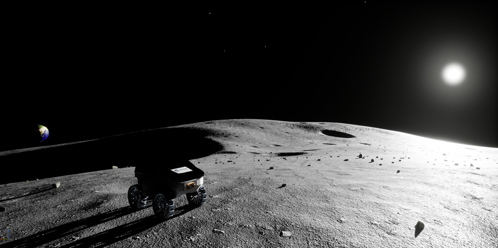
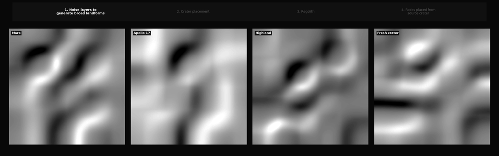

# LunarSim-PG

**LunarSim-PG**  is a high-fidelity lunar rover simulation framework built with
Unreal Engine 5 and integrated with ROS 2. It combines controllable rover and
stereo-camera simulation, science-parameterized procedural terrain generation,
configurable lunar illumination, and synchronized sensor and ground-truth data
within a single environment.

The framework supports both closed-loop robotics experiments and offline
synthetic dataset generation. Users can create reproducible lunar scenes with
configurable crater and rock distributions, adjust sun elevation and azimuth,
control the rover through WASD or ROS 2 `cmd_vel`, and generate data for visual
odometry, SLAM, obstacle detection, semantic segmentation, mapping, and
traversability research.

This enables repeatable evaluation of perception and navigation algorithms
across different terrain, lighting, and sensor configurations.

  

## Core capabilities

- **High-fidelity lunar simulation** — Unreal Engine 5 rendering with
  lunar-specific terrain, materials, illumination, and shadows, together with
  a controllable wheeled rover and stereo-camera system.

- **ROS 2 integration** — Publish time-stamped stereo images, camera
  calibration, simulated IMU, ground-truth rover state, maps, transforms, and
  simulation time, while accepting rover commands through ROS 2.

- **Ground-truth data generation** — Capture visual, geometric, semantic, pose,
  trajectory, and terrain outputs organized by capture frame and simulation
  timestamp for perception, navigation, mapping, and dataset-generation
  workflows.

  

- **Procedural lunar terrain generation** — Generate reproducible terrain from
  regional profiles and random seeds, with configurable crater populations,
  degradation states, rock abundance, and crater-coupled rock placement.

  

## Prerequisites

- Ubuntu 22.04 or 24.04.
- Unreal Engine 5.7.x for Linux; project setup rejects other engine versions.
- Git with Git LFS installed before cloning or pulling, plus `curl`, `jq`, and
  Python 3.
- Docker Engine.
- Docker Compose v2.

Docker Engine and Docker Compose v2 are required for the intended full
LunarSim-PG workflow.

See the [installation guide](docs/installation.md) for detailed setup
instructions and workflow details.

## Quick start

### 1. Clone the repository

```bash
git lfs install
git clone https://github.com/exarchosioannis/LunarSim-PG.git
cd LunarSim-PG
git lfs pull
```

LunarSim-PG stores its large Unreal Engine assets with Git LFS. These commands
download the actual assets instead of leaving Git LFS pointer files.

### 2. Prepare the project and save the Unreal Engine path

```bash
./setup.sh --ue-root /path/to/UnrealEngine-5.7.x
```

Replace `/path/to/UnrealEngine-5.7.x` with the engine root containing
`Engine/Build/Build.version`.

### 3. Build and open the project

```bash
./build.sh
./open_project.sh
```

- `setup.sh` prepares dependencies, validates the Unreal Engine path, and saves
  it for later terminal sessions.
- `build.sh` compiles the Unreal Editor project.
- `open_project.sh` opens `LunarSimPG.uproject` in Unreal Editor.

## How to use LunarSim-PG

### 1. Choose a lunar environment

Once the project opens, choose one of the included levels from
`Content/Levels/`:

| Level | Description |
| --- | --- |
| `apollo17` | Apollo 17-inspired valley and highland terrain combining sloped landforms, impact craters, and scattered boulders. Intended for representative rover visual-navigation experiments. |
| `highland` | Rugged, heavily cratered highland terrain with older, bigger, more degraded craters, pronounced relief, and increased surface roughness. Suitable for challenging perception and navigation tests.|
| `mare` | Relatively smooth, low-relief basaltic mare terrain with fewer craters and sparse rocks. Provides a simpler baseline environment with broad, weakly textured surfaces. |
| `fresh_crater` | Terrain dominated by a comparatively fresh impact crater with a sharp rim, visible ejecta structure, and concentrated blocky rocks. Intended for obstacle detection and traversability experiments. |
| `custom` | A more densely populated terrain with increased crater and rock abundance, creating a visually richer and more obstacle-heavy environment for general testing and demonstrations. |

You can also create your own lunar terrain by following the
[terrain-generation guide](docs/terrain-generation.md).

### 2. Configure your simulation

Open **Window > Simulator > Simulator Config** and choose the settings you need
for your experiment.

For example, you can select:

- which ground-truth outputs to generate
- whether to publish stereo images through ROS 2
- pose, trajectory, and timing outputs
- rover control through WASD or ROS 2 `cmd_vel`
- lunar illumination conditions through configurable sun elevation and azimuth

When you are ready, press **Apply Settings**.

For a full explanation of every option, see the
[configuration guide](docs/configuration.md).

### 3. Start the simulation

Start **Play In Editor** to begin the simulation.

LunarSim-PG creates a new run directory under `Saved/Datasets/`, where your
selected configuration and generated outputs are organized.

### 4. Start and stop capture

With the Play In Editor viewport active, press `C` whenever you want to start
capturing data. Press `C` again to stop.

Depending on your settings, LunarSim-PG can save ground-truth data and publish
stereo images through ROS 2. Each capture is stored in its own
`Session_NNN` directory.

## Data outputs

LunarSim-PG can save synchronized ground-truth data directly to
`Saved/Datasets/` while also publishing live data through ROS 2.

Saved datasets can include RGB, depth, segmentation, bounding boxes, rover and
camera trajectories, session metadata, and ground-truth terrain maps. The ROS 2
interface provides stereo images, camera calibration, IMU data, rover
ground-truth state, maps, transforms, simulation time, capture control, and
`cmd_vel` rover commands.

[Explore the available data and ROS 2 interface](docs/data-and-ros2.md).

## Key plugins

- [UnrealGT](https://github.com/unrealgt/unrealgt) provides ground-truth RGB,
  depth, segmentation, and bounding-box generation. LunarSim-PG uses a modified
  version with asynchronous GPU readback, camera warm-up, and frame/timestamp
  association.
- [TempoROS](https://github.com/tempo-sim/TempoROS) provides the bridge between
  Unreal Engine and ROS 2.
- **Chaos Vehicles** is Unreal Engine’s built-in vehicle system used for the
  rover’s wheeled movement and control.


## Documentation

- [Documentation home](docs/README.md)
- [Installation](docs/installation.md)
- [Simulator configuration](docs/configuration.md)
- [Terrain generation](docs/terrain-generation.md)
  - [Heightmap and crater generation model](docs/terrain-generation-model.md)
  - [Rock distribution model](docs/rock-distribution-model.md)
- [Data outputs and ROS 2](docs/data-and-ros2.md)


## Current scope

**LunarSim-PG**  focuses on visual and geometric simulation for rover perception
and navigation, supporting both ROS 2-based experiments and synthetic dataset
generation.

It is not intended as a mission-analysis or terramechanics simulator.
Terrain–wheel interaction, dust dynamics, and thermal modelling are outside
the scope of the current framework.

## Contributors and acknowledgements

**LunarSim-PG** was developed by **Ioannis Exarchos** and
**María González Rodríguez** as their joint project at
**ESA Spaceship Poland**.

### Main contributions

- **Ioannis Exarchos** — system architecture and integration,
  Unreal Engine–ROS 2 integration, rover and sensor pipeline,
  synchronized ground-truth and dataset-generation pipeline,
  and simulator configuration tools.
- **María González Rodríguez** — science-parameterized procedural
  terrain generation, regional terrain profiles, crater morphology
  model, and coupled crater–rock distribution models.
- **Noora Archer** — lunar visual assets, materials and environment
  modelling, and technical guidance on high-fidelity lunar scene
  representation.

Additional scientific and technical guidance was provided by
**Marek Kraft**.

This work was supported by the **European Space Agency** through **ΕSA Spaceship Poland**.

<br>

<p align="center">
  
</p>

<p align="center">
  <sub>Developed as part of ESA Spaceship Poland.</sub>
</p>
