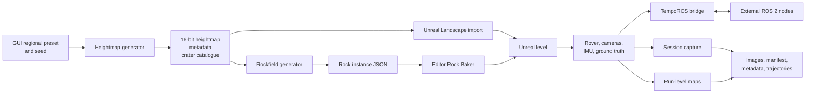

# Architecture

LunarSim-PG has two connected toolchains:

1. A desktop Python tool generates terrain assets and metadata.
2. An Unreal Editor project simulates the rover, publishes ROS 2 data, and
   writes ground-truth datasets.

The terrain tool does not automatically create or modify an Unreal Landscape.
Its heightmap and rockfield products are imported through Unreal Editor
workflows.

## Terrain toolchain

`Tools/Terrain_Generation/moonsim.sh` embeds the five user-facing regional
presets and launches a Tk GUI. A preset supplies a heightmap model, rock
profile, seed, map dimensions, encoded height range, crater abundance, and
rock-distribution settings. These profiles are Python dictionaries inside the
script, not standalone configuration files.

The heightmap generator creates:

- a 16-bit PNG for Unreal Landscape import;
- physical scale and generator metadata;
- a centered crater catalogue;
- a human-readable generation summary.

The selected heightmap package then drives the rockfield generator. Rock
placement includes background populations and crater-owned interior, rim,
proximal, and distal zones. The resulting JSON contains individual instance
positions, dimensions, orientation, burial, material, and source associations.

In Unreal Editor, the Landscape heightmap is imported using the scale recorded
in `metadata.json`. The **Rock Baker** reads the generated JSON, traces the
landscape, and creates hierarchical instanced static meshes from meshes below
`/Game/Meshes/Rocks`.

## Unreal runtime

The `simulator` runtime module owns:

- capture scheduling and run/session organization;
- rover manual and `cmd_vel` controllers;
- stereo RGB and camera calibration publication;
- IMU publication;
- live ground-truth pose, odometry, path, and TF;
- occupancy, elevation, and slope map production;
- Unreal-to-ROS coordinate conversion.

UnrealGT supplies Blueprint-integrated RGB, encoded depth, color-coded
segmentation, and bounding-box generators. TempoROS embeds ROS 2 Humble
interfaces and supplies node, publisher, subscriber, clock, and TF support.

The `simulatorEditor` module provides **Simulator Config**, level setup actions,
and the Rock Baker. Configuration and baking are editor operations; they are
locked while Play In Editor is running.

## ROS 2 and closed-loop operation

TempoROS publishes sensor and ground-truth messages directly from the Unreal
process. External ROS 2 nodes communicate on domain ID `9` through Cyclone DDS.
The project workspace contains a teleoperation launch file; a larger autonomy
stack is not included.

In `cmd_vel` mode, the simulator subscribes to `/cmd_vel` and uses
`linear.x` and `angular.z`. Manual and ROS control are mutually selected in the
editor configuration. The complete implemented interface is in
[ROS 2 interface](ros2-interface.md).

## Capture and synchronization

A capture request creates `Session_NNN` within the dataset run created for the
current Play In Editor session. The capture manager assigns one `frame_index`
and one Unreal world-time `timestamp_sec` to each scheduled capture:

- the manifest row uses that pair;
- enabled ground-truth image generators use the frame index as the filename;
- enabled rover and camera trajectory rows use the same pair;
- ROS stereo messages for that capture use the same world-time stamp.

IMU, live rover ground truth, TF, `/clock`, and run-level maps have independent
publish schedules but share Unreal world time. They are not indexed in the
offline manifest. Record them in a rosbag when they must accompany a dataset.

Image writing is asynchronous, and the repository has no automated
completeness or cross-modality synchronization validator. See
[Output format](output-format.md) for the exact guarantees and limitations.

## Implemented boundaries

- The legacy “Dataset” and “ROS2 Live” enum values are retained only for asset
  compatibility. Current capture behavior is unified and selected by output
  toggles, not by separate execution modes.
- Terrain seed, profile, and preview illumination metadata are not propagated
  into Unreal session metadata.
- Scripted rover trajectories and a complete autonomy stack are not present.
- Packaged and headless simulator entry points are not present.

