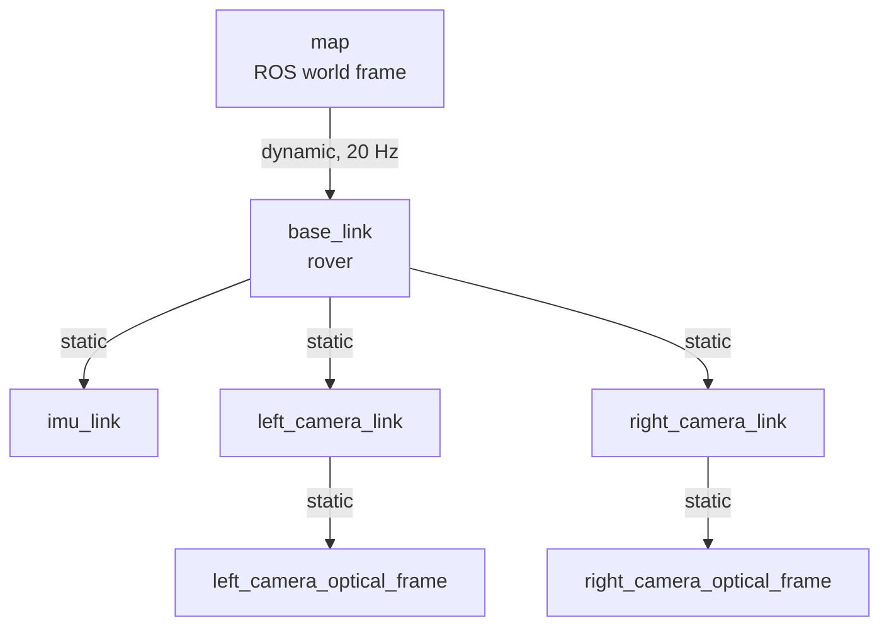

# Coordinate frames

LunarSim-PG converts Unreal poses into a ROS-style right-handed, SI-unit
coordinate system before publishing or writing trajectory CSV files.

## Axis and unit conversion

| System | Handedness | +X | +Y | +Z | Linear unit |
| --- | --- | --- | --- | --- | --- |
| Unreal world | Left-handed | Forward | Right | Up | Centimeters |
| ROS project frames | Right-handed | Forward | Left | Up | Meters |

For an Unreal position in centimeters:

```text
x_ros =  x_unreal / 100
y_ros = -y_unreal / 100
z_ros =  z_unreal / 100
```

For a normalized Unreal quaternion in `x, y, z, w` order:

```text
q_ros = (-qx_unreal, qy_unreal, -qz_unreal, qw_unreal)
```

The resulting quaternion is normalized again. ROS messages and trajectory CSV
files store quaternion components in `x, y, z, w` order.

## TF hierarchy



| Frame | Role | Parent | Source |
| --- | --- | --- | --- |
| `map` | Fixed ROS world/map frame | None | TempoROS fixed-frame setting |
| `base_link` | Rover body frame | `map` | Rover actor transform |
| `imu_link` | IMU sensor frame | `base_link` | `IMU_Mount` component transform |
| `left_camera_link` | Left/reference camera link | `base_link` | Left camera transform |
| `right_camera_link` | Right camera link | `base_link` | Right camera transform |
| `left_camera_optical_frame` | Left image/calibration frame | `left_camera_link` | Fixed link-to-optical rotation |
| `right_camera_optical_frame` | Right image/calibration frame | `right_camera_link` | Fixed link-to-optical rotation |

There is no published `odom` frame. Ground-truth odometry uses `map` as its
header frame and `base_link` as its child frame.

## Poses and trajectories

| Interface | Parent / header frame | Child or pose frame |
| --- | --- | --- |
| `/ground_truth/pose` | `map` | Rover pose |
| `/ground_truth/odom` | `map` | `base_link` |
| `/ground_truth/path` | `map` | Sequence of rover poses |
| Rover trajectory CSV | `map` | `base_link` |
| Left camera trajectory CSV | `map` | `left_camera_link` |
| Right camera trajectory CSV | `map` | `right_camera_link` |
| Occupancy/elevation maps | `map` | Grid or points |

Trajectory translations are meters and rotations are quaternions. Each row
also includes the capture frame index and Unreal world-time timestamp.

## Stereo cameras

The left camera is the reference camera at the camera-rig origin. Unreal places
the right camera at local `+Y` by the configured baseline. Because ROS negates
Unreal Y, the right camera lies in the negative ROS Y direction relative to the
left camera.

Image and CameraInfo headers use optical frames, not camera-link frames. The
fixed link-to-optical transform encodes the camera convention:

- optical `+Z` points forward;
- optical `+X` points right in the image;
- optical `+Y` points down in the image.

The right camera projection matrix stores:

```text
Tx = -fx * stereo_baseline_m
```

Both cameras share `fx`, `fy`, `cx`, `cy`, and zero distortion coefficients.
See [Configuration](configuration.md) for their derivation.

## IMU

`/imu/data` is expressed in `imu_link`. Orientation, angular velocity, and
linear acceleration are converted into the sensor/ROS convention. Linear
acceleration represents specific force using active Unreal world gravity; a
supported stationary sensor therefore reports gravity opposition, while ideal
free fall reports zero.

The IMU has its own publication schedule but uses the same Unreal world-time
base as the other simulator messages.

## Terrain coordinates

Terrain-generation files use two related conventions:

| Data | Convention |
| --- | --- |
| `heightmap.png` | X=0 at the left edge and Y=0 at the top edge; physical scale is in `metadata.json` |
| `craters.json` | Centered X/Y meters from `-map_size/2` to `+map_size/2` |
| `unreal_rockfield.json` | `centered_map_meters` |

The Rock Baker maps rock X/Y meters directly to Unreal X/Y centimeters before
tracing the terrain. These offline centered coordinates are an Unreal import
convention, not ROS coordinates; the baker does not negate Y.

## Images and depth

ROS RGB data is `bgr8`. Bounding-box consumers in the included script treat X
as horizontal and Y as vertical, but the implementation does not explicitly
declare the exported image pixel origin. Pixel-origin semantics are therefore
**Not yet verified**.

Depth values decode to millimeters. Whether the current serialized
ground-truth camera uses planar distance or perspective/ray distance by default
is **Not yet verified**. See [Output format](output-format.md) for the channel
encoding.

## Time

`/clock`, ROS sensor headers, ground-truth messages, TF, manifests, and
trajectory rows use Unreal world time. `session_metadata.json.created_at` and
dataset run directory names use wall-clock time instead.
