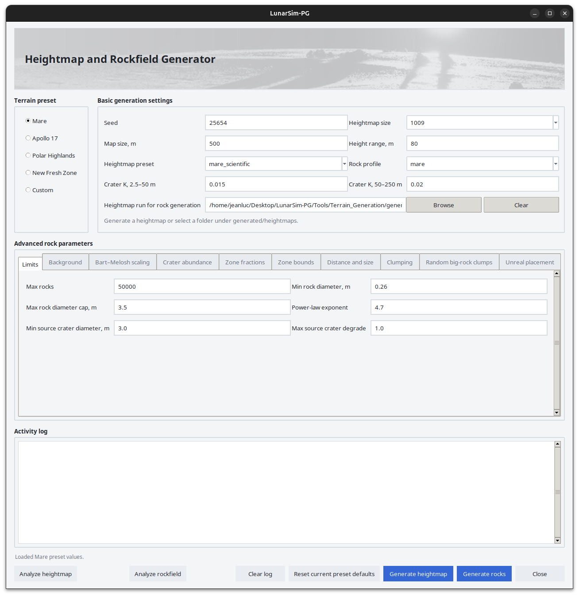
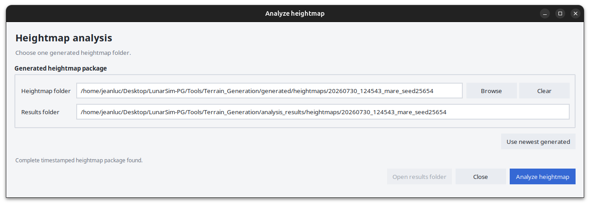
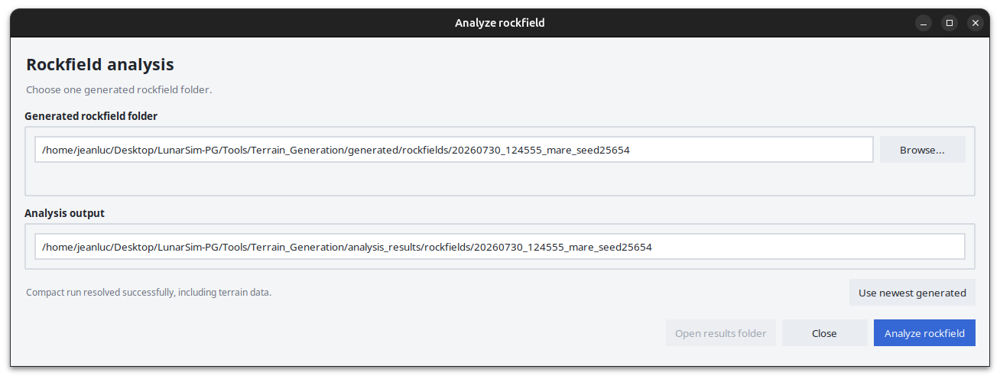

# MoonSim GUI Guide


## Table of contents

- [Graphical interface](#graphical-interface)
  - [Heightmap analysis](#heightmap-analysis)
  - [Rockfield analysis](#rockfield-analysis)
- [Workflow](#workflow)
  - [Why heightmap generation comes first](#why-heightmap-generation-comes-first)
- [Where files are written](#where-files-are-written)
  - [Heightmap run package](#heightmap-run-package)
  - [Rockfield run package](#rockfield-run-package)
  - [Analysis products](#analysis-products)
- [Terrain presets](#terrain-presets)
- [Quick reference: which control should I change?](#quick-reference-which-control-should-i-change)
- [Detailed explanation of Basic generation settings](#basic-generation-settings)
- [Detailed explanation of Advanced rock parameters](#advanced-rock-parameters)
  - [How the rock model is assembled](#how-the-rock-model-is-assembled)
  - [Limits](#limits)
  - [Background](#background)
  - [Bart–Melosh scaling](#bartmelosh-scaling)
  - [Crater abundance](#crater-abundance)
  - [Zone fractions](#zone-fractions)
  - [Zone bounds](#zone-bounds)
  - [Distance and size](#distance-and-size)
  - [Clumping](#clumping)
  - [Random big-rock clumps](#random-big-rock-clumps)
  - [Unreal placement](#unreal-placement)
- [Analysis tools](#analysis-tools)
  - [Analyze heightmap](#analyze-heightmap)
  - [Analyze rockfield](#analyze-rockfield)
- [Common problems](#common-problems)

## Graphical interface

The main MoonSim window contains the terrain presets, basic generation
settings, advanced rock parameters, activity log, generation controls and
analysis tools.



## Heightmap analysis

Select **Analyze heightmap** to open the heightmap analysis window.



## Rockfield analysis

Select **Analyze rockfield** to open the rockfield analysis window.



## Workflow

1. Select a **Terrain preset** on the left.
2. Set the **Seed**, **Heightmap size** and **Map size**.
3. Adjust the two **Crater K** values if you want a different crater population.
4. Click **Generate heightmap**.
5. Optionally click **Analyze heightmap** and inspect the elevation, slope, roughness, and crater statistics. The **Use newest generated** button automatically selects
the most recent complete heightmap package.
7. Optionally Adjust the advanced rock parameters.
8. Click **Generate rocks**.
9. Click **Analyze rockfield** to inspect rock sizes, ejecta zones, source craters, density, and clumping. The **Use newest generated** button automatically
selects the most recently generated rockfield.
10. Import the copies under `unreal_import/` into Unreal Engine.

### Why heightmap generation comes first

Rock generation requires a complete heightmap package containing:

- the 16-bit heightmap,
- matching metadata,
- and the generated crater catalog.

The GUI automatically selects the most recently generated complete heightmap run automatically. You can also choose a previous folder under `generated/heightmaps/`.


## Where files are written

### Heightmap run package

A generated heightmap run is stored under:

```text
generated/heightmaps/<timestamp>_<terrain>_seed<seed>/
```

It contains four primary files with timestamped names:

- `*_heightmap.png` — 16-bit landscape heightmap
- `*_metadata.json` — scale, range, settings, provenance, and file references
- `*_craters.json` — generated crater catalog
- `*_generation_summary.txt` — short human-readable summary

The Unreal-ready heightmap copy is written to:

```text
unreal_import/heightmaps/<run_name>.png
```

### Rockfield run package

A generated rockfield run is stored under:

```text
generated/rockfields/<timestamp>_<terrain>_seed<seed>/
```

It contains:

- `*_rockfield.json` — rock candidates and placement metadata
- `rock_settings.json` — exact settings used
- `source_heightmap.json` — links back to the source heightmap package

The Unreal-ready rockfield copy is written to:

```text
unreal_import/rockfields/<run_name>.json
```

### Analysis products

Analysis output is written under:

```text
analysis_results/heightmaps/
analysis_results/rockfields/
```

Each analysis run creates timestamped PNG figures plus JSON, CSV, and text summaries.


## Terrain presets

The radio buttons in **Terrain preset** load a complete set of heightmap and rockfield values. This is the easiest and safest way to switch terrain families.

| Preset | Intended result |
|---|---|
| **Mare** | Smoother, older mare terrain with a comparatively restrained rock population and strong concentration around rims and proximal ejecta. |
| **Apollo 17** | Taurus–Littrow-style terrain with compact crater rockfields, strong rim weighting, and a steep rock-size distribution dominated by smaller rocks. |
| **Polar Highlands** | Rougher highland terrain, larger possible rocks, wider ejecta zones, and more source craters contributing rocks. |
| **New Fresh Zone** | Young, blocky, crater-rich terrain with fresh-crater filtering, high per-crater rock caps, and extended ejecta. |
| **Custom** | A highland-like starting point with elevated crater abundance and random big-rock clumps enabled. |


## Quick reference: which control should I change?

| Goal | Primary controls |
|---|---|
| More small craters | Crater K, 2.5–50 m |
| More large craters | Crater K, 50–250 m |
| Finer terrain detail | Larger Heightmap size or smaller Map size |
| More crater-owned rocks | Crater boulder density scale, Max rocks per crater, Max rocks |
| More background rocks | Background density, Background fraction cap, Max rocks |
| More large rocks | Lower Power-law exponent, higher Boulder diameter scale, higher size multipliers, higher max cap |
| Rocks farther from craters | Zone maxima, Boulder distance scale, lower distance powers |
| Large rocks only near craters | Higher Distance size decay |
| More visible patches | Crater clump fraction, Background clump fraction, random big-rock clumps |
| Tighter patches | Lower cluster sigma |
| Fresher source craters only | Lower Max source crater degrade, higher Freshness gamma |
| More buried rocks | Higher minimum and maximum burial fractions |
| Faster generation/import | Smaller heightmap, lower Max rocks, fewer clumps |


<a id="basic-generation-settings"></a>
## Detailed explanation of *Basic generation settings*

| Setting | What it controls | Larger value or changes | Important notes |
|---|---|---|---|
| <a id="basic-seed"></a>**Seed** | Controls the deterministic random streams used for terrain, craters, rocks, tilt, and burial. | Increasing the number does not create more terrain features or rocks. It simply produces a different deterministic arrangement. | The same seed combined with the same settings produces the same output. |
| <a id="basic-heightmap-size"></a>**Heightmap size** | Sets the number of height samples along each side of the terrain. Available values are `1009`, `2017`, and `4033`. | A larger value gives finer spatial resolution, smaller meters-per-pixel, smoother-looking crater edges, and better preservation of small features. It also increases memory use and generation and analysis time. | At the same map size, a larger heightmap gives more pixels to each terrain feature. |
| <a id="basic-map-size-m"></a>**Map size, m** | Sets the real-world width and height of the square terrain. | A larger value covers more area. Expected crater count rises approximately with area, so doubling the side length gives roughly four times the expected craters before other effects. Background-rock demand also rises. At a fixed heightmap resolution, meters-per-pixel becomes larger and terrain features receive fewer pixels. | Keep this consistent with the selected heightmap package. A mismatch can crop rocks, change the background-rock area, or make rock coordinates disagree with the terrain. |
| <a id="basic-height-range-m"></a>**Height range, m** | Sets the full vertical interval encoded into the 16-bit heightmap. In the GUI's fixed range mode, the interval is centered around zero. | A larger value provides more vertical headroom and produces a larger Unreal Landscape Z Scale. However, each 16-bit step represents more height, reducing vertical precision. | For example, a value of `80 m` encodes elevations from `-40 m` to `+40 m`. This setting changes the export encoding and Unreal Z Scale. It does **not** make the procedural terrain itself rougher, deeper, or taller. Terrain outside the selected range is clipped. |
| <a id="basic-heightmap-preset"></a>**Heightmap preset** | Selects the hidden heightmap morphology configuration. | Changing the preset replaces the non-GUI terrain settings used for base relief, broad landforms, crater degradation, crater depth, rim shape, ejecta, secondary chains, and surface roughness. | Choices are `mare_scientific`, `apollo17_scientific`, `highland_scientific`, `fresh_crater_scientific`, and `custom_scientific`. |
| <a id="basic-rock-profile"></a>**Rock profile** | Selects the default rockfield configuration associated with a terrain type. | Changing the profile loads a different set of defaults for rock abundance, size distribution, crater zones, clumping, materials, and placement behavior. | Choices are `mare`, `apollo_17`, `polar_highlands`, `new_fresh_zone`, and `custom`. The values displayed in the advanced rock tabs can override the profile defaults. |
| <a id="basic-crater-k-2-5-50-m"></a>**Crater K, 2.5–50 m** | Controls the abundance coefficient for craters between `2.5 m` and `50 m` in diameter. | A larger value approximately linearly increases the expected number of small craters. More small craters can also create more potential rock sources, depending on the source-crater diameter and freshness filters. | A value of `0` disables the normal crater population for this diameter segment. A preset may still generate procedural secondary craters from larger parent craters. The expected crater count for each diameter segment is proportional to: map area × K × (Dmin^-b - Dmax^-b) Because crater generation is stochastic, this equation describes the expected population rather than guaranteeing an exact crater count.|
| <a id="basic-crater-k-50-250-m"></a>**Crater K, 50–250 m** | Controls the abundance coefficient for craters between `50 m` and `250 m` in diameter. | A larger value increases the expected number of large craters. Large craters affect more terrain, may create wider ejecta zones, and can generate more and larger crater-owned rocks. | A value of `0` disables the normal large-crater segment. Because the map may only be a few hundred meters wide, large-crater counts are stochastic. A moderate change may produce no visible difference for one seed but a large difference for another. The expected crater count for each diameter segment is proportional to: map area × K × (Dmin^-b - Dmax^-b) Because crater generation is stochastic, this equation describes the expected population rather than guaranteeing an exact crater count.|
| <a id="basic-heightmap-run-for-rock-generation"></a>**Heightmap run for rock generation** | Selects the complete generated heightmap package used as the source for rock generation. | Not applicable; this is a folder selection rather than a numeric value. Selecting a different run changes the terrain metadata and crater catalogue used to place rocks. | Select a complete heightmap run folder, not an individual PNG or JSON file. **Browse** validates the folder and resolves its heightmap, metadata, and crater catalogue. **Clear** removes the selected source. **Generate rocks** uses the selected run; if none is selected, it uses the current generated heightmap run when available. |


<a id="advanced-rock-parameters"></a>
## Detailed explanation of *Advanced rock parameters*

### Index of advanced settings

1. [Limits](#limits)
2. [Background](#background)
3. [Bart–Melosh scaling](#bartmelosh-scaling)
4. [Crater abundance](#crater-abundance)
5. [Zone fractions](#zone-fractions)
6. [Zone bounds](#zone-bounds)
7. [Distance and size](#distance-and-size)
8. [Clumping](#clumping)
9. [Random big-rock clumps](#random-big-rock-clumps)
10. [Unreal placement](#unreal-placement)


### How the rock model is assembled

Rock generation runs in this order:

1. Generate crater-owned rocks.
2. Add background rocks.
3. Add optional random big-rock clumps.
4. Stop whenever **Max rocks** is reached.

This means an early category can consume the global cap and leave no capacity for later categories.

A normalized crater radius is written as `r/R`:

- `r` = distance from the crater center
- `R` = crater radius
- `r/R = 1.0` = nominal crater rim
- `r/R = 2.0` = two crater radii from the center


### Limits

| Setting | What it controls | Larger value | Important notes |
|---|---|---|---|
| <a id="advanced-max-rocks"></a>**Max rocks** | Sets the global maximum number of generated rocks. | Allows denser fields and more complete fulfillment of crater, background, and random-clump requests. It also increases JSON size and Unreal placement cost. | Generation stops when this limit is reached. Early categories can consume the entire limit and prevent later categories from generating. `0` generates no rocks. |
| <a id="advanced-min-rock-diameter-m"></a>**Min rock diameter, m** | Sets the lower bound used by all sampled rock diameters. | Removes smaller rocks and shifts the entire output toward larger rocks, which can greatly reduce visual clutter. | Must be positive. |
| <a id="advanced-max-rock-diameter-cap-m"></a>**Max rock diameter cap, m** | Sets the global upper size limit for normal crater-owned and background rocks. | Allows larger boulders when crater scaling and zone multipliers request them. | Must be equal to or greater than **Min rock diameter**. Other local size limits can still prevent rocks from reaching this value. |
| <a id="advanced-power-law-exponent"></a>**Power-law exponent** | Controls the shape of the sampled rock-diameter distribution. | Produces a steeper distribution, with more rocks close to the minimum diameter and relatively fewer large rocks. | Must be positive. A lower value produces a heavier large-rock tail. |
| <a id="advanced-min-source-crater-diameter-m"></a>**Min source crater diameter, m** | Sets the smallest crater allowed to own a rock population. | Ignores more small craters, concentrates rocks around larger craters, and usually reduces the total crater-owned rock count. | Small craters below this diameter remain in the terrain but do not generate their own rock populations. |
| <a id="advanced-max-source-crater-degrade"></a>**Max source crater degrade** | Sets the oldest or most degraded crater allowed to generate rocks. Degradation is clamped to `0–1`, where `0` is fresh and `1` is old. | Allows older and more degraded craters to produce rocks. | `0` accepts only completely fresh craters. A value of `1` allows the full degradation range. |


### Background

The GUI uses the `maxrocks` background-cap mode:

```text
requested background = map area × background density
background cap = max rocks × background fraction cap
actual background = min(requested, cap, remaining global capacity)
```

| Setting | What it controls | Larger value | Important notes |
|---|---|---|---|
| <a id="advanced-background-density-m2"></a>**Background density / m²** | Sets the requested density of non-crater background rocks across the map. | Requests more background rocks across the terrain. | The background fraction cap or remaining global capacity may prevent the actual count from increasing. `0` disables normal background rocks. |
| <a id="advanced-background-fraction-cap"></a>**Background fraction cap** | Sets the maximum share of **Max rocks** that background generation may use. | Allows background rocks to consume more of the global rock capacity. | Must be between `0` and `1`. Lower values keep the field more strongly dominated by crater-owned rocks. |
| <a id="advanced-background-clump-fraction"></a>**Background clump fraction** | Sets the fraction of background rocks assigned to clumps rather than independent uniform positions. | Creates a more patchy background with more rocks grouped into clusters and fewer isolated placements. | The effective value is internally limited to `0.8`. `0` makes all background rocks independent placements. |
| <a id="advanced-background-cluster-sigma-m"></a>**Background cluster sigma, m** | Sets the standard deviation of the offsets around background-clump centers. | Produces wider, softer, and more spread-out background patches. | `0` places clump children at the clump center before map-bound checks. |

Background rocks use the global minimum diameter and a local maximum of:

```text
min(0.75 m, Max rock diameter cap)
```

They therefore remain relatively small even when the global maximum diameter cap is very large.


### Bart–Melosh scaling

The generator uses source-crater diameter `D` to estimate local rock size and reach.

Approximate maximum-diameter model:

```text
maximum diameter reference = A × D^B × Boulder diameter scale
```

Approximate maximum-distance model:

```text
maximum distance reference = A × D^B × Boulder distance scale
```

The resulting values are then limited by the global diameter caps and configured ejecta-zone bounds.

| Setting | What it controls | Larger value | Important notes |
|---|---|---|---|
| <a id="advanced-max-diameter-coefficient-a"></a>**Max diameter coefficient A** | Sets the linear coefficient in the maximum-diameter reference law. | Raises the possible maximum size of crater-owned rocks for every source crater. | Final diameters are still restricted by the global minimum and maximum diameter settings. |
| <a id="advanced-max-diameter-exponent-b"></a>**Max diameter exponent B** | Controls how strongly maximum rock size responds to source-crater diameter. | Makes large craters gain maximum rock size much faster than small craters. | This changes the contrast between rock populations produced by small and large craters. |
| <a id="advanced-median-diameter-coefficient-a"></a>**Median diameter coefficient A** | Sets the coefficient in the median-diameter reference law. In the current generator, this helps enforce a minimum local maximum for rim and proximal rocks. | Keeps the rim and proximal size ceilings higher. | This affects local size limits rather than the number of generated rocks. |
| <a id="advanced-median-diameter-exponent-b"></a>**Median diameter exponent B** | Controls how strongly the median-diameter reference responds to source-crater diameter. | Gives large craters a stronger increase in the rim and proximal size floor. | This affects the relationship between crater size and local rock-size limits. |
| <a id="advanced-max-distance-coefficient-a"></a>**Max distance coefficient A** | Sets the linear coefficient for maximum boulder reach. | Extends the scaling-based reach around all source craters. | The configured proximal and distal zone bounds may become the active limit before the calculated reach is reached. |
| <a id="advanced-max-distance-exponent-b"></a>**Max distance exponent B** | Controls how strongly maximum reach responds to source-crater diameter. | Makes large craters extend their rockfields disproportionately farther than small craters. | Final reach is still limited by the configured zone bounds. |
| <a id="advanced-boulder-distance-scale"></a>**Boulder distance scale** | Multiplies the maximum-distance reference. | Extends the possible proximal and distal reach of crater-owned rocks. | Increasing it may stop producing visible changes once `proximal_r_max` or `distal_r_max` becomes the active limit. |


### Crater abundance

The approximate crater-owned rock count is:

```text
count = density scale
      × ejecta area
      × freshness factor
      × (crater diameter / 50 m)^(count exponent - 1)
```

The result is rounded and limited by **Max rocks per crater** and the global **Max rocks** value.

| Setting | What it controls | Larger value | Important notes |
|---|---|---|---|
| <a id="advanced-boulder-diameter-scale"></a>**Boulder diameter scale** | Multiplies the Bart–Melosh maximum and median diameter references. | Increases the possible size of crater-owned rocks in every zone. | It changes rock size limits but does not directly change the requested rock count. |
| <a id="advanced-crater-boulder-density-scale"></a>**Crater boulder density scale** | Acts as the primary linear multiplier for crater-owned rock count. | Produces more rocks per eligible crater and raises the recorded local-density proxy. | `0` disables crater-owned rocks. The final count can still be restricted by per-crater and global limits. |
| <a id="advanced-crater-count-exponent"></a>**Crater count exponent** | Controls how rock count scales with crater diameter around a `50 m` pivot crater. | Values above `1` increasingly favor craters larger than `50 m` while suppressing craters smaller than `50 m`. | At exactly `1`, the crater-diameter-dependent count factor is neutral. Lower values shift more of the contribution toward smaller source craters. |
| <a id="advanced-freshness-gamma"></a>**Freshness gamma** | Sets the exponent in `(1 - degradation)^gamma`. | More strongly suppresses rocks from partially degraded craters while leaving perfectly fresh craters unchanged. | The code uses a minimum effective value of `0.01`. |
| <a id="advanced-freshness-floor"></a>**Freshness floor** | Sets the minimum freshness factor after gamma is applied. | Guarantees more rocks and a higher local size ceiling for old but accepted craters. | Must be between `0` and `1`. |
| <a id="advanced-max-rocks-per-crater"></a>**Max rocks per crater** | Sets the maximum number of rocks that any single source crater may generate. | Allows large or fresh craters to create much denser individual rockfields. | `0` disables crater-owned rocks even when the density scale is greater than zero. The global **Max rocks** limit still applies. |

---

### Zone fractions

These four values are relative probabilities for assigning each non-clumped crater-owned rock to a crater zone. IMPORTANT: The four fractions must sum to exactly `1.0`.

| Setting | What it controls | Larger value | Important notes |
|---|---|---|---|
| <a id="advanced-interior-fraction"></a>**Interior fraction** | Sets the relative probability that a crater-owned rock is assigned to the crater interior or floor. | Allocates more rocks to crater floors. | The four zone fractions must sum to `1.0`. Increasing this value normally requires reducing one or more other fractions. |
| <a id="advanced-rim-fraction"></a>**Rim fraction** | Sets the relative probability that a crater-owned rock is assigned to the rim zone. | Allocates more rocks around the crater rim. | The four zone fractions must sum to `1.0`. |
| <a id="advanced-proximal-fraction"></a>**Proximal fraction** | Sets the relative probability that a crater-owned rock is assigned to proximal ejecta. | Allocates more rocks to nearby ejecta around the crater. | The four zone fractions must sum to `1.0`. |
| <a id="advanced-distal-fraction"></a>**Distal fraction** | Sets the relative probability that a crater-owned rock is assigned to distal ejecta. | Allocates more rocks to the far-ejecta zone. | The four zone fractions must sum to `1.0`. |


### Zone bounds

| Setting | What it controls | Larger value | Important notes |
|---|---|---|---|
| <a id="advanced-interior-r-min"></a>**Interior r min** | Sets the inner boundary of crater-floor placement. | Moves the start of interior placement away from the crater center, creating a larger central gap. | Must not be greater than **Interior r max**. |
| <a id="advanced-interior-r-max"></a>**Interior r max** | Sets the outer boundary of crater-floor placement. | Extends interior placements farther toward, or potentially beyond, the crater rim. | It also affects how clump children are reclassified after their offsets are applied. |
| <a id="advanced-rim-r-min"></a>**Rim r min** | Sets the inner boundary of the rim zone. | Moves sampled rim rocks farther outward from the crater center. | Must not be greater than **Rim r max**. |
| <a id="advanced-rim-r-max"></a>**Rim r max** | Sets the outer boundary of the rim zone. | Widens the rim zone outward. | It also establishes the minimum reach used by the maximum-distance scaling calculation. |
| <a id="advanced-proximal-r-min"></a>**Proximal r min** | Sets the inner boundary of proximal ejecta. | Moves proximal-ejecta placements farther away from the crater rim. | Must not be greater than **Proximal r max**. |
| <a id="advanced-proximal-r-max"></a>**Proximal r max** | Sets the requested outer boundary of proximal ejecta. | Requests a wider proximal-ejecta field. | The Bart–Melosh maximum-distance calculation may prevent rocks from reaching the full configured boundary. |
| <a id="advanced-distal-r-min"></a>**Distal r min** | Sets the inner boundary of distal ejecta. | Starts distal ejecta farther from the crater and may create a gap after the proximal zone. | Must not be greater than **Distal r max**. |
| <a id="advanced-distal-r-max"></a>**Distal r max** | Sets the outer boundary of distal ejecta and the absolute normalized outer cap for crater-owned placement. | Allows the requested crater-owned rockfield to extend farther from the crater. | Maximum-distance scaling may still reduce the effective outer boundary. |


It does not prevent overlapping or out-of-order zones. 


### Distance and size

#### Distance power controls

Within a zone, normalized radius is sampled approximately as:

```text
r = r_min + (r_max - r_min) × random^power
```

| Setting | What it controls | Larger value | Important notes |
|---|---|---|---|
| <a id="advanced-interior-distance-power"></a>**Interior distance power** | Controls the radial distribution of rocks inside the crater-floor zone. | Concentrates floor rocks closer to `interior_r_min`. | A value of `1.0` is approximately uniform across the configured radial interval. |
| <a id="advanced-rim-distance-power"></a>**Rim distance power** | Controls the radial distribution of rocks inside the rim zone. | Concentrates rim rocks closer to `rim_r_min`. | This does not change the configured zone boundaries. |
| <a id="advanced-proximal-distance-power"></a>**Proximal distance power** | Controls the radial distribution of rocks inside proximal ejecta. | Concentrates proximal rocks near the inner proximal boundary. | This changes distribution within the zone, not the requested count. |
| <a id="advanced-distal-distance-power"></a>**Distal distance power** | Controls the radial distribution of rocks inside distal ejecta. | Concentrates distal rocks near the inner distal boundary. | This changes distribution within the zone, not the requested count. |

#### Size controls

The local maximum diameter is reduced with distance approximately as:

```text
local maximum ∝ (r/R)^(-distance size decay) × zone size multiplier
```

The result is also reduced for degraded craters and clamped to the global diameter limits.

| Setting | What it controls | Larger value | Important notes |
|---|---|---|---|
| <a id="advanced-distance-size-decay"></a>**Distance size decay** | Controls how quickly the local maximum rock diameter decreases with distance from the crater. | Makes maximum rock size fall faster with distance, creating a stronger large-near and small-far pattern. | At `0`, distance no longer reduces the local size ceiling. |
| <a id="advanced-interior-size-multiplier"></a>**Interior size multiplier** | Multiplies the local maximum diameter for crater-floor rocks. | Allows larger rocks inside crater floors. | It changes the local size ceiling, not the number of rocks. |
| <a id="advanced-rim-size-multiplier"></a>**Rim size multiplier** | Multiplies the local maximum diameter for rim rocks. | Allows larger rocks around crater rims. | Rim logic may still preserve the median-diameter reference as a minimum local ceiling. |
| <a id="advanced-proximal-size-multiplier"></a>**Proximal size multiplier** | Multiplies the local maximum diameter for proximal-ejecta rocks. | Allows larger rocks in nearby ejecta. | It changes the local size ceiling, not the number of rocks. |
| <a id="advanced-distal-size-multiplier"></a>**Distal size multiplier** | Multiplies the local maximum diameter for distal-ejecta rocks. | Allows larger rocks in far ejecta. | Distal rocks may still remain small because distance-size decay also reduces their local maximum. |

Size multipliers change the local maximum rock diameter. They do not directly change the requested rock count.

---

### Clumping

| Setting | What it controls | Larger value or changes | Important notes |
|---|---|---|---|
| <a id="advanced-crater-clump-fraction"></a>**Crater clump fraction** | Sets the fraction of each crater's requested rocks placed through clump parents rather than independent positions. | Places a larger share of crater-owned rocks into visible clusters or patches. | The effective value is capped at `0.95`. `0` disables crater-owned clumps. |
| <a id="advanced-mean-cluster-size"></a>**Mean cluster size** | Sets the Poisson mean number of child rocks attempted per crater clump. It is also used at half strength for background clumps. | Creates fewer but larger and denser patches for the same total clumped-rock target. | Individual clumps remain stochastic, so their exact child counts vary. |
| <a id="advanced-cluster-sigma-m"></a>**Cluster sigma, m** | Sets the standard deviation of child offsets around crater-clump parents. | Produces wider and more diffuse clusters. More children may cross zone boundaries or leave the map. | `0` stacks children at the parent position. |
| <a id="advanced-cluster-zone-bias"></a>**Cluster zone bias** | Selects which zones are used when placing crater-clump parents. | Changing the choice moves clump parents between rim, proximal, and distal ejecta regions. | This is a choice control rather than a numeric setting. See the options below. |

`Cluster zone bias` options:

| Choice | Parent-zone behavior |
|---|---|
| `rim` | All clump parents are sampled inside the rim zone. |
| `proximal` | All clump parents are sampled inside proximal ejecta. |
| `rim_proximal` | Approximately 55% of clump parents are placed in the rim and 45% in proximal ejecta. |
| `all_ejecta` | Approximately 35% are placed in the rim, 45% in proximal ejecta, and 20% in distal ejecta. |


### Random big-rock clumps

These are independent background clumps and are not owned by any crater.

They are generated after crater-owned and normal background rocks, so they can use only the capacity remaining under **Max rocks**.

| Setting | What it controls | Larger value or changes | Important notes |
|---|---|---|---|
| <a id="advanced-enable-random-big-rock-clumps"></a>**Enable random big-rock clumps** | Acts as the master switch for this generation stage. | When enabled, the generator attempts to create the configured random big-rock clumps. | When disabled, all other settings in this section are ignored. |
| <a id="advanced-random-big-rock-clump-count"></a>**Random big-rock clump count** | Sets the target number of clump centers that successfully place at least one rock. | Creates more separate large-rock patches across the terrain. | `0` disables this category even when the master switch is enabled. The final count may be lower if the global rock cap is reached. |
| <a id="advanced-random-big-rock-mean-rocks-clump"></a>**Random big-rock mean rocks/clump** | Sets the Poisson mean number of child rocks attempted per random clump. | Produces denser and more populated clumps and consumes the remaining global capacity more quickly. | Exact child counts vary because they are sampled stochastically. |
| <a id="advanced-random-big-rock-clump-sigma-m"></a>**Random big-rock clump sigma, m** | Sets the spatial spread of rocks around each random-clump center. | Produces larger and looser patches. | Small values produce tight piles. |
| <a id="advanced-random-big-rock-min-diameter-m"></a>**Random big-rock min diameter, m** | Sets the requested lower diameter bound for random-clump rocks. | Makes every rock in this category larger. | The effective minimum is the greater of this value and the global **Min rock diameter**. |
| <a id="advanced-random-big-rock-max-diameter-m"></a>**Random big-rock max diameter, m** | Sets the requested upper diameter bound for random-clump rocks. | Allows a larger upper tail of boulder sizes. | The effective maximum is normally limited by the global **Max rock diameter cap**. |
| <a id="advanced-exclude-crater-min-diameter-m"></a>**Exclude crater min diameter, m** | Sets the minimum crater diameter required for that crater to create an exclusion zone around itself. | Causes fewer craters to qualify for exclusion, allowing random clumps to appear near more craters. | `0` disables crater-based exclusion. |
| <a id="advanced-exclude-crater-radius-multiplier"></a>**Exclude crater radius multiplier** | Sets the radius of the exclusion area around qualifying craters, measured as a multiple of crater radius. | Keeps random big-rock clumps farther away from qualifying craters. | `0` disables the exclusion distance. |


### Unreal placement

These settings generate deterministic metadata for each rock. They do not change rock count or XY position.

| Setting | What it controls | Larger value | Important notes |
|---|---|---|---|
| <a id="advanced-max-random-tilt-degrees"></a>**Max random tilt, degrees** | Sets the upper bound of a uniform random tilt sampled between `0` and this value. | Allows more strongly tilted rocks and creates greater orientation variation. | Values are clamped to `0–90` degrees. |
| <a id="advanced-min-burial-fraction"></a>**Min burial fraction** | Sets the lower bound of the uniformly sampled burial fraction. For example, `0.2` means 20% burial. | Raises the shallowest possible burial, so every generated rock becomes more embedded. | Must be between `0` and **Max burial fraction**. |
| <a id="advanced-max-burial-fraction"></a>**Max burial fraction** | Sets the upper bound of the uniformly sampled burial fraction. | Allows some rocks to become more deeply embedded. | Must be greater than or equal to **Min burial fraction** and no greater than `1`. |


## Analysis tools

### Analyze heightmap

Choose a complete generated heightmap folder. The GUI automatically resolves the matching heightmap, metadata, and crater catalog.

The analysis calculates terrain and crater metrics and produces:

- elevation map,
- hillshade,
- slope map,
- local roughness map,
- combined overview,
- statistical plots,
- metrics JSON,
- metrics CSV,
- text summary.


### Analyze rockfield

Choose a complete generated rockfield folder. The GUI resolves the rockfield JSON, settings, source-heightmap manifest, crater catalog, metadata, and heightmap when available.

The analysis produces:

- rockfield overview,
- crater/ejecta zone map,
- rocks grouped by source crater,
- density field,
- large-rock map,
- merged per-rock CSV,
- metrics CSV,
- analysis JSON,
- text summary.


<!-- ## Practical tuning recipes

### Increase crater density without changing crater sizes

1. Keep the same seed.
2. Increase one or both **Crater K** values.
3. Leave heightmap size, map size, and heightmap preset unchanged.
4. Generate and analyze the new heightmap.

Increase the small-segment K for more local surface pitting. Increase the large-segment K for more dominant landforms and potential large rock sources.

### Make the terrain sharper in Unreal

- Increase **Heightmap size** while keeping **Map size** unchanged.
- Keep **Height range** only as large as necessary to avoid clipping.
- Do not use Height range as a terrain-amplitude control; it only changes encoding and Z Scale.

### Add more rocks everywhere

- Increase **Max rocks**.
- Increase **Crater boulder density scale** for crater-owned rocks.
- Increase **Background density / m²** and, if necessary, **Background fraction cap**.

Watch for the global cap. If the output count equals **Max rocks**, raising densities will only change which stage consumes the budget.

### Make rocks larger without adding more

- Lower **Power-law exponent** for a heavier large-rock tail.
- Increase **Boulder diameter scale**.
- Increase the relevant zone size multipliers.
- Increase **Max rock diameter cap** if it is clipping the result.

Check the large-rock map and diameter percentiles after each change.

### Concentrate rocks around crater rims

- Increase **Rim fraction** and reduce other fractions so the total remains `1.0`.
- Choose `rim` or `rim_proximal` for **Cluster zone bias**.
- Increase **Rim distance power** to pull placements toward `rim_r_min`.
- Increase **Rim size multiplier** if rim rocks should also be larger.

### Extend an ejecta field farther outward

- Increase **Proximal r max** and/or **Distal r max**.
- Increase **Boulder distance scale** or maximum-distance A/B if Bart–Melosh reach is currently limiting the zone.
- Decrease the relevant distance power to push samples toward the outer edge.
- Decrease **Distance size decay** if far rocks should remain large.

### Make an old terrain lose rocks more strongly

- Reduce **Max source crater degrade** to reject old source craters.
- Increase **Freshness gamma** to suppress partially degraded sources.
- Reduce **Freshness floor** so very old accepted craters contribute almost nothing.

### Create sparse but dramatic boulder patches

- Enable random big-rock clumps.
- Use a moderate clump count.
- Increase minimum and maximum clump diameters.
- Keep mean rocks per clump moderate.
- Increase sigma for wide debris patches or reduce it for tight piles.
- Confirm **Max rock diameter cap** is not below the desired sizes.

### Improve performance

- Use a smaller heightmap resolution while testing.
- Reduce **Max rocks**.
- Increase **Min rock diameter** to remove tiny rocks.
- Increase **Min source crater diameter** to ignore numerous small craters.
- Reduce clump counts and per-clump means.
- Analyze a lower-cost test run before generating a final 4033 map and large rockfield. -->


## Common problems


### “Generate rocks” says no complete heightmap run is available

Generate a heightmap first or click **Browse** and select the run folder under `generated/heightmaps/`. Do not select only the PNG.

### Rock output always reaches Max rocks

The model is cap-limited. Reduce one or more densities or increase the cap. Remember the order: crater-owned rocks are created before background and random clumps.

### Increasing background density does nothing

One of these limits is active:

- **Background fraction cap**,
- remaining capacity under **Max rocks**,
- or the requested count is already above the cap.

### Increasing distal range does nothing

The Bart–Melosh maximum-distance calculation may be the active limit. Increase **Boulder distance scale**, **Max distance coefficient A**, or **Max distance exponent B**, then inspect the output again.

### The model contains almost no large rocks

Check, in order:

1. **Power-law exponent** may be very high.
2. **Max rock diameter cap** may be low.
3. **Boulder diameter scale** may be low.
4. Zone size multipliers may be low.
5. **Distance size decay** may shrink distant rocks strongly.
6. Source craters may be too small, old, or filtered out.

### Clumps contain fewer rocks than requested

Children are discarded when they leave the map, enter background outside configured crater zones, or fall inside a random-clump exclusion zone. Large sigma values and narrow zones make this more likely. The generator has attempt guards and may report partial placement warnings.

### Heightmap imports with clipped flat peaks or pits

The fixed **Height range** is too small for the generated actual minimum/maximum. Increase it and regenerate, then use the Z Scale recorded in the new metadata or generation summary.

### Heightmap looks vertically weak after import

Use the X/Y/Z scale values recorded in the generated metadata or summary. Do not assume Unreal's default Z Scale matches the encoded range.