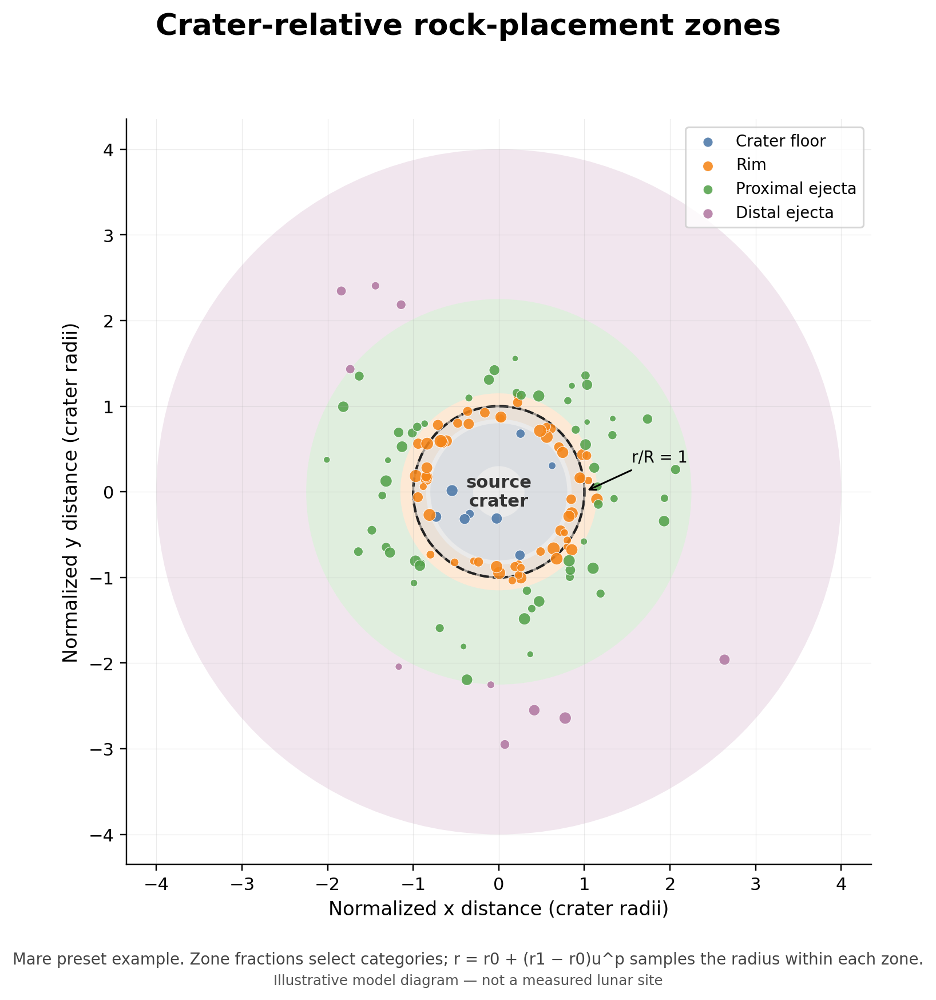
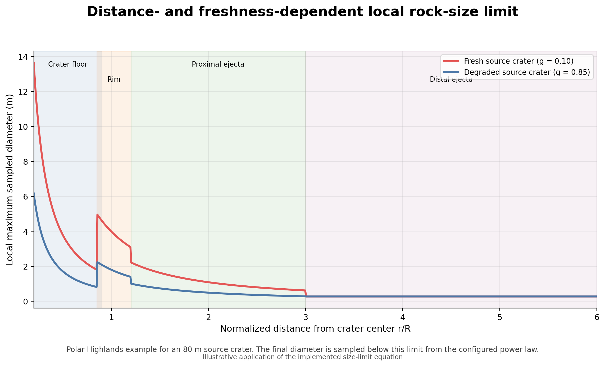
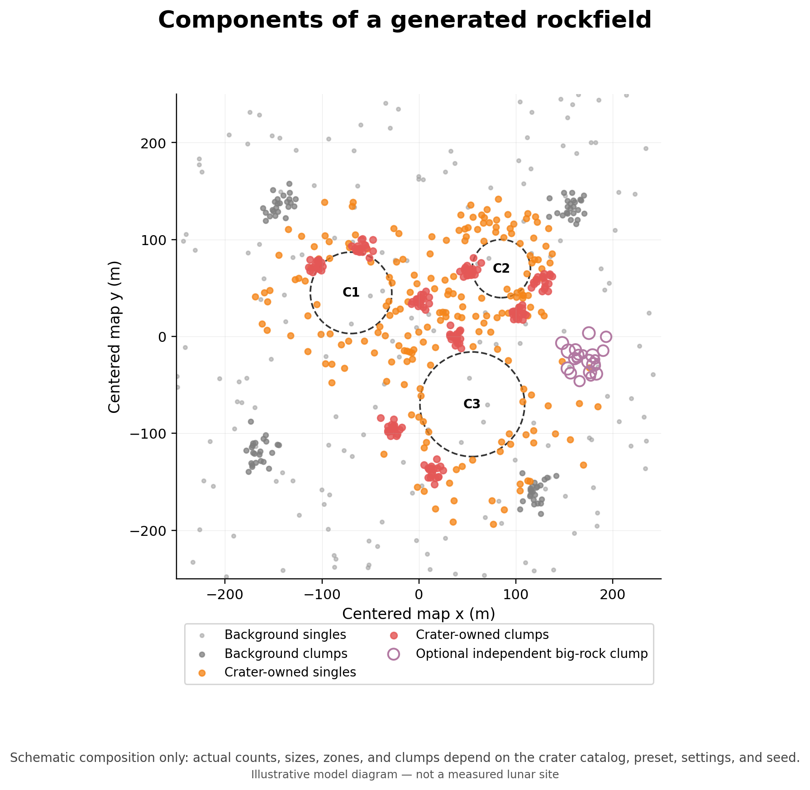

# Rock distribution model

This page describes the statistical rock-distribution model implemented by
`Tools/Terrain_Generation/rockfield_generator.py` and configured by the MoonSim
asset-generator GUI.

The model is a **crater-first, scientifically informed procedural model**. It
uses empirical relationships for lunar ejecta boulder size and distance,
observed boulder size-frequency distributions, and regional rock-abundance
trends. Procedural controls convert those constraints into a finite set of rock
instances suitable for Unreal Engine.

It is not a fragmentation simulation, an ejecta-ballistics model, or a direct
reconstruction of a measured boulder field.

## Model overview

Rock generation proceeds in this order:

1. Filter the crater catalog by source-crater diameter and degradation.
2. Generate crater-owned rocks, including single rocks and crater-centered
   clumps.
3. Generate a regional background population, including optional background
   clumps.
4. Generate optional independent big-rock clumps.
5. Assign deterministic orientation and burial parameters.
6. Stop when `max_rocks` is reached.

This order makes the crater-associated population primary. The GUI currently
uses `background_cap_mode = maxrocks`, which permits a useful regional
background even when the crater-owned population is sparse.

## Deterministic random stream

The generator uses a small Python implementation of Unreal's deterministic
`FRandomStream` fraction sequence. The same seed, crater catalog, settings, and
code produce the same rock positions and sizes.

Yaw, tilt, tilt axis, and burial use a separate deterministic stream derived
from the seed and instance ID. Adding those placement fields therefore does not
change the already sampled rock population.

## Source-crater filter and freshness

A crater is eligible when:

```text
crater diameter >= min_source_crater_diameter_meters
and
crater degradation <= max_source_crater_degrade
```

For an eligible crater with degradation `g`, the implemented freshness factor
is:

```text
F = max(freshness_floor, (1 - g)^freshness_gamma)
```

Freshness influences the number of crater-owned rocks and their maximum local
size. The mapping from the terrain generator's degradation value to preserved
boulder abundance is procedural, but it follows the observed trend that large
boulder populations diminish as craters age.

## Crater-to-boulder scaling

The generator stores the following Bart–Melosh-style coefficients:

```text
raw maximum boulder diameter = 0.40 D^0.65
raw median boulder diameter  = 0.078 D^0.62
raw maximum boulder distance = 0.024 D^0.66
```

Here `D` is source-crater diameter in meters. The diameter relationships are
multiplied by the preset's `boulder_diameter_scale` and limited by
`min_rock_diameter` and `max_rock_diameter_cap`.

The distance relationship is multiplied by `boulder_distance_scale = 1000` in
the GUI presets, then used to limit the outer normalized ejecta zone. The scale
factor is an implementation unit/tuning conversion rather than a new empirical
law.

`bm_median_distance_a` and `bm_median_distance_b` are currently stored and
editable, but the implemented placement algorithm does not use them. Only the
maximum-distance relationship limits the radial zones.

## Number of rocks assigned to a crater

For source-crater radius `R`, the algorithm first calculates a distance-limited
outer ejecta radius `r_outer R`. The approximate modeled ejecta area is:

```text
A_ejecta = pi ((r_outer R)^2 - (0.85 R)^2)
```

The requested crater-owned count is then:

```text
N_crater = crater_boulder_density_scale
           * A_ejecta
           * F
           * max(0.1, D / 50)^(crater_count_exponent - 1)
```

The result is rounded and limited by `max_rocks_per_crater` and the global
`max_rocks` cap.

`crater_boulder_density_scale` is a generator calibration coefficient. It
should not be interpreted as a directly measured physical boulder density.
The exact count exponent and caps are also procedural.

## Radial zones

Each crater-owned rock is assigned to one of four normalized radial zones,
where normalized radius is distance from the crater center divided by crater
radius:

- `CraterFloor` 
- `Rim`
- `ProximalEjecta`
- `DistalEjecta`

The zone is selected from editable fractions. Within a zone `[r0, r1]`, radius
is sampled as:

```text
r = r0 + (r1 - r0) u^p
```

where `u` is uniform on `[0, 1]` and `p` is the zone's distance power. For the
current values, larger `p` biases samples toward the inner edge of the zone.
Azimuth is uniform.

The radial boundaries and fractions are procedural controls informed by the
observed concentration of large rocks near crater rims and the decline in rock
size and abundance with distance.



### GUI zone defaults

| GUI preset | Floor fraction | Rim fraction | Proximal fraction | Distal fraction | Floor `r/R` | Rim `r/R` | Proximal `r/R` | Distal `r/R` |
| --- | ---: | ---: | ---: | ---: | --- | --- | --- | --- |
| Mare | 0.03 | 0.45 | 0.44 | 0.08 | 0.30–0.80 | 0.85–1.15 | 1.15–2.25 | 2.25–4.00 |
| Apollo 17 | 0.08 | 0.55 | 0.32 | 0.05 | 0.25–0.85 | 0.85–1.20 | 1.20–2.00 | 2.00–3.00 |
| Polar Highlands | 0.12 | 0.38 | 0.38 | 0.12 | 0.20–0.90 | 0.85–1.20 | 1.20–3.00 | 3.00–6.00 |
| New Fresh Zone | 0.04 | 0.38 | 0.45 | 0.13 | 0.20–0.85 | 0.85–1.20 | 1.20–3.00 | 3.00–8.00 |
| Custom | 0.12 | 0.38 | 0.38 | 0.12 | 0.20–0.90 | 0.85–1.20 | 1.20–3.00 | 3.00–6.00 |

The maximum-distance scaling can shorten the requested proximal or distal outer
boundary for a particular crater.

## Rock size at a sampled location

The crater-level maximum diameter is reduced with normalized distance and
modified by zone and freshness:

```text
local maximum = crater maximum
                * max(0.08, r^-distance_size_decay)
                * zone_size_multiplier
                * (0.35 + 0.65 F)
```

Rim and proximal locations are prevented from falling below the modeled median
boulder diameter, subject to the global diameter cap.

The final diameter is sampled from a truncated cumulative power law between
`min_rock_diameter` and the local maximum:

```text
N(>=d) proportional to d^-beta
```

where `beta` is `power_law_exponent`. Larger exponents produce a population more
strongly dominated by small rocks.



## Crater-owned clumps

A fraction of each crater's requested rocks is assigned to clumps. A clump
parent is sampled in the configured rim/ejecta zone, the child count is sampled
from a Poisson distribution, and child offsets are Gaussian with standard
deviation `cluster_sigma_m`.

Clumping reproduces the patchy appearance of block fields but is procedural.
The preset's `cluster_zone_bias`, clump fraction, mean child count, and spatial
sigma are not direct measurements from the cited studies.

## Background population

The requested background count is:

```text
N_background_requested = map area * background_density_per_m2
```

With the GUI's `maxrocks` cap mode, the accepted count is limited to:

```text
max_rocks * background_fraction_cap
```

and to the remaining global rock capacity. A configured fraction of background
rocks is placed in Gaussian clumps; the rest are spatially uniform. Background
rock diameters use the same power-law exponent but are capped at 0.75 m before
the global diameter cap.

The cited rock-abundance studies describe fractional surface area covered by
rocks. Converting those abundance parameters into `background_density_per_m2`
is procedural, so this field should be treated as a generator count-density
control rather than a direct copy of the published abundance parameter `k`.



## Optional independent big-rock clumps

The Custom GUI preset enables independent big-rock clumps. Their parents are
uniformly sampled outside configured exclusion regions around large craters.
Child counts are Poisson and positions are Gaussian around each parent.

This pass is an intentional scenario-generation feature. It is not tied to a
specific ejecta source and should not be interpreted as a physically traced
crater-boulder relationship.

## GUI preset summary

These are selected values from the current GUI defaults. `rock_settings.json`
remains authoritative for a run.

| GUI preset | Max rocks | Diameter range | Size exponent | Background density | Crater density scale | Count exponent | Freshness gamma/floor | Max per crater | Crater clump fraction |
| --- | ---: | --- | ---: | ---: | ---: | ---: | --- | ---: | ---: |
| Mare | 50,000 | 0.26–3.5 m | 4.7 | 0.0045/m² | 0.35 | 2.25 | 1.0 / 0.01 | 300 | 0.40 |
| Apollo 17 | 60,000 | 0.26–8.6 m | 6.8 | 0.012/m² | 0.040 | 2.30 | 2.4 / 0.05 | 400 | 0.70 |
| Polar Highlands | 70,000 | 0.26–20 m | 3.8 | 0.010/m² | 0.060 | 1.35 | 1.2 / 0.005 | 3,000 | 0.65 |
| New Fresh Zone | 100,000 | 0.26–14.2 m | 5.3 | 0.0070/m² | 0.0100 | 1.35 | 1.5 / 0.05 | 5,200 | 0.75 |
| Custom | 100,000 | 0.26–20 m | 3.8 | 0.012/m² | 0.080 | 1.35 | 1.2 / 0.005 | 3,500 | 0.70 |

The minimum diameter of 0.26 m follows the boulder-identification threshold
used by Watkins et al. The larger caps and power-law exponents use values from
specific measured crater examples as preset anchors; they are not predictions
that every source crater in the generated map must contain a boulder at the
preset cap.

## Orientation, slope, and burial metadata

Each rock receives random yaw, tilt, tilt axis, and burial fraction within the
selected limits. The current GUI defaults use a maximum random tilt of
12 degrees and burial from 0.2 to 0.6.

The offline `local_slope_deg` field is a zone-, crater-size-, and
freshness-based proxy. It is not sampled from the generated heightmap. Actual
terrain contact, ground-normal alignment, vertical position, and mesh-dependent
burial are resolved by the Unreal Rock Baker.

## Scientific basis

The implementation uses the literature in the following limited ways:

- **Bart and Melosh (2010):** supplies empirical crater-to-boulder scaling for
  maximum boulder diameter and motivates a crater-dependent maximum transport
  distance. It also supports the trend that large boulders are concentrated
  near the crater rim while smaller boulders occur farther away.
- **Watkins et al. (2019):** supplies the 25.6 cm boulder threshold and measured
  examples for boulder counts, largest boulders, power-law slopes, radial
  trends, and reduction of large boulders with age. The Mare, Apollo 17,
  Highlands, and Fresh presets use different measured craters as anchors.
- **Li and Wu (2018):** supports regionally varying rock abundance and the
  concentration of rocks around rocky ejecta craters. The conversion from
  published areal abundance to generator count density is procedural.

## What is measured and what is procedural

| Component | Status in MoonSim |
| --- | --- |
| Crater-to-maximum-boulder diameter trend | Empirically constrained |
| Larger boulders preferentially near crater rims | Empirically constrained |
| Boulder size-frequency distributions being approximately power-law above the detection threshold | Empirically constrained |
| Example power-law slopes, largest boulders, and counts used as preset anchors | Literature-derived anchors |
| Fresh craters retaining more and larger boulders | Empirically constrained qualitatively |
| Conversion from rock area fraction to count density | Procedural |
| Freshness exponent and floor | Procedural |
| Crater rock-count equation and density scale | Procedural, observation-calibrated |
| Exact radial-zone fractions and boundaries | Procedural, observation-informed |
| Distance powers and zone size multipliers | Procedural |
| Clump fractions, means, and Gaussian widths | Procedural |
| Independent big-rock clumps | Procedural scenario feature |
| Random yaw, tilt, and burial ranges | Procedural placement metadata |

## Limitations

- The generator samples candidate rock centers in 2D; it does not perform ejecta
  trajectories, fragmentation physics, collision avoidance, or stability tests.
- The source crater catalog contains a simplified degradation scalar rather than
  a physical crater age.
- The rock count model is calibrated for visually useful 500 m-scale maps and
  should not be extrapolated as a measured lunar density law.
- Background rocks are independent of the heightmap's local slope, roughness,
  and material boundaries.
- Radial distributions are azimuthally symmetric except for Gaussian clumping;
  impact-angle asymmetry and mapped rays are not represented.
- `local_slope_deg` is a proxy, and actual Unreal placement depends on Landscape
  traces and available rock meshes.
- Internal command-line scientific profile defaults and GUI presets are not
  identical. Use `rock_settings.json` when reporting or reproducing a GUI run.
- Valid numeric input does not guarantee a scientifically plausible or
  computationally practical field.

## References

- Bart, G. D., and Melosh, H. J. (2010), *Distributions of boulders ejected from
  lunar craters*, Icarus 209, 337–357.
  <https://doi.org/10.1016/j.icarus.2010.05.023>
- Watkins, R. N., et al. (2019), *Boulder distributions around young, small
  lunar impact craters and implications for regolith production rates and
  landing site safety*, Journal of Geophysical Research: Planets 124.
  <https://doi.org/10.1029/2019JE005963>
- Li, Y., and Wu, B. (2018), *Analysis of rock abundance on lunar surface from
  orbital and descent images using automatic rock detection*, Journal of
  Geophysical Research: Planets 123, 1061–1088.
  <https://doi.org/10.1029/2017JE005496>
