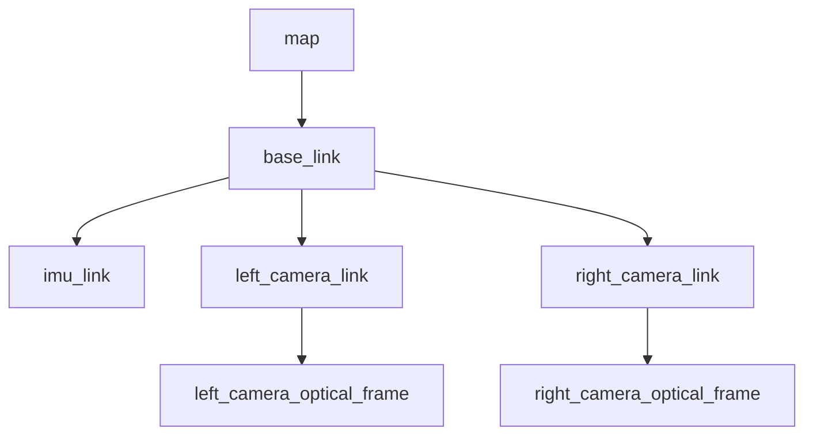

# ROS 2 interface

The Unreal process uses TempoROS with ROS 2 Humble, Cyclone DDS, domain ID `9`,
and fixed frame `map`. The supplied container is the documented client
environment.

## Start the client environment

From the repository root:

```bash
docker compose -f docker/docker-compose.yml up -d
docker exec -it sim_ros bash
```

Inside the container:

```bash
source /opt/ros/humble/setup.bash
cd /ws/ros2_ws
colcon build --symlink-install
source install/setup.bash
```

Start Play In Editor before checking simulator topics.

## Published topics

| Topic | Message type | Publisher | Rate | QoS | Description |
| --- | --- | --- | --- | --- | --- |
| `/stereo/left/image_raw` | `sensor_msgs/msg/Image` | Unreal camera rig | Capture Hz, active capture only | Reliable, volatile, depth 20 | Left `bgr8` image in `left_camera_optical_frame` |
| `/stereo/left/camera_info` | `sensor_msgs/msg/CameraInfo` | Unreal camera rig | With left image | Reliable, volatile, depth 20 | Pinhole intrinsics and left projection matrix |
| `/stereo/right/image_raw` | `sensor_msgs/msg/Image` | Unreal camera rig | Capture Hz, active capture only | Reliable, volatile, depth 20 | Right `bgr8` image in `right_camera_optical_frame` |
| `/stereo/right/camera_info` | `sensor_msgs/msg/CameraInfo` | Unreal camera rig | With right image | Reliable, volatile, depth 20 | Pinhole intrinsics and right stereo projection matrix |
| `/imu/data` | `sensor_msgs/msg/Imu` | Rover IMU component | 100 Hz default; capped by game-thread FPS | Reliable, volatile, depth 50 | Orientation, angular velocity, and sensor-frame specific force in `imu_link` |
| `/ground_truth/pose` | `geometry_msgs/msg/PoseStamped` | Rover ground-truth component | 20 Hz default | Reliable, volatile, depth 10 | Rover pose in `map` |
| `/ground_truth/odom` | `nav_msgs/msg/Odometry` | Rover ground-truth component | 20 Hz default | Reliable, volatile, depth 10 | Ground-truth pose and derived twist; parent `map`, child `base_link` |
| `/ground_truth/path` | `nav_msgs/msg/Path` | Rover ground-truth component | 10 Hz default | Reliable, transient local, depth 1 | Up to 5000 poses in `map`; reset when capture starts |
| `/ground_truth/map/occupancy` | `nav_msgs/msg/OccupancyGrid` | Map publisher | Generated once; republished every 5 s | Reliable, transient local, depth 1 | 0.40 m grid in `map` |
| `/ground_truth/map/elevation_points` | `sensor_msgs/msg/PointCloud2` | Map publisher | Generated once; republished every 5 s | Reliable, transient local, depth 1 | Float32 `x`, `y`, `z` fields in meters |
| `/clock` | `rosgraph_msgs/msg/Clock` | TempoROS clock server | Every unpaused Unreal frame | Reliable, transient local | Unreal simulation time |
| `/tf` | `tf2_msgs/msg/TFMessage` | TempoROS TF | Rover transform at 20 Hz | Standard dynamic-TF profile | Dynamic `map` to `base_link` |
| `/tf_static` | `tf2_msgs/msg/TFMessage` | TempoROS TF | Once at initialization | Standard static-TF profile | IMU and stereo camera static transforms |

“Capture Hz” is the value configured in **Simulator Config**; 6 Hz is the
default. Effective camera and IMU rates depend on Unreal frame/render
performance.

The frame index remains internal to dataset manifests and trajectory CSV files.
There is no frame-index ROS topic.

## Subscribed topics

| Topic | Message type | Subscriber | QoS | Behavior |
| --- | --- | --- | --- | --- |
| `/capture/control` | `std_msgs/msg/Int32` | Camera/capture pipeline | Reliable, volatile, depth 1 | `1` starts capture; `0` stops it; other values are ignored |
| `/cmd_vel` | `geometry_msgs/msg/Twist` | Rover controller | Reliable, volatile, depth 1 | Uses `linear.x` in m/s and `angular.z` in rad/s when control mode is `cmd_vel` |

The `cmd_vel` defaults are 1 m/s maximum linear speed, 1 rad/s maximum angular
speed, a 0.02 normalized dead zone, and a 0.75-second timeout followed by rover
stop/idle brake.

## Services

| Service | Type | Description |
| --- | --- | --- |
| None | — | No ROS 2 services are implemented. |

## Actions

| Action | Type | Description |
| --- | --- | --- |
| None | — | No ROS 2 actions are implemented. |

## Parameters

| Simulator parameter | Type | Description |
| --- | --- | --- |
| None | — | No runtime ROS 2 parameters are implemented by the simulator. |

The arguments exposed by `teleop.launch.py` configure the external `joy` and
`teleop_twist_joy` nodes; they are not simulator parameters.

## TF frames



`map -> base_link` is dynamic. All remaining transforms are static. An `odom`
frame is not published. See [Coordinate frames](coordinate-frames.md) for axes,
units, and conversions.

## Inspect the interface

Inside the sourced container:

```bash
ros2 topic list
ros2 topic info /stereo/left/image_raw --verbose
ros2 topic echo /clock --once
ros2 topic hz /imu/data
ros2 run tf2_tools view_frames
```

Camera topics are created by the rig, but image data requires active capture:

```bash
bash /ws/scripts/startcapture
ros2 topic hz /stereo/left/image_raw
```

Stop the rate command with `Ctrl+C`, then start:

```bash
ros2 run rqt_image_view rqt_image_view
```

Select `/stereo/left/image_raw` in rqt.

## Control the rover

Before Play In Editor, choose **cmd_vel** in Simulator Config and apply the
setting. To publish one direct command:

```bash
ros2 topic pub /cmd_vel geometry_msgs/msg/Twist \
  "{linear: {x: 0.25}, angular: {z: 0.0}}" --once
```

For a Logitech F710 in XInput mode:

```bash
ros2 launch simulator_ros teleop.launch.py
```

Hold right bumper button 5. Left-stick Y maps to linear X and left-stick X maps
to angular yaw. Default launch arguments are:

| Argument | Default |
| --- | --- |
| `config_file` | Installed `simulator_ros/config/f710.yaml` |
| `joy_device_id` | `0` |
| `joy_device_name` | `Logitech Gamepad F710` |
| `joy_deadzone` | `0.05` |
| `joy_autorepeat_rate` | `20.0` Hz |
| `joy_topic` | `/joy` |
| `cmd_vel_topic` | `/cmd_vel` |

## Record a rosbag

Inside the sourced container:

```bash
cd /ws/bags
ros2 bag record \
  /clock /tf /tf_static \
  /stereo/left/image_raw /stereo/left/camera_info \
  /stereo/right/image_raw /stereo/right/camera_info \
  /imu/data \
  /ground_truth/pose /ground_truth/odom /ground_truth/path \
  /ground_truth/map/occupancy /ground_truth/map/elevation_points \
  /cmd_vel
```

Start simulator capture before expecting image messages. Stop recording with
`Ctrl+C`. The Compose mount makes the bag available in the host `bags/`
directory.

## Time and synchronization

`/clock`, sensor headers, live ground truth, TF, and offline trajectory stamps
derive from Unreal world time. A camera image and its matching CameraInfo share
one stamp. ROS consumers should enable simulated time where their own node
supports it.

IMU, rover ground truth, maps, and cameras run on different schedules. They are
time-correlated, not assigned a common ROS frame-index message. See
[Output format](output-format.md) for offline frame association.
