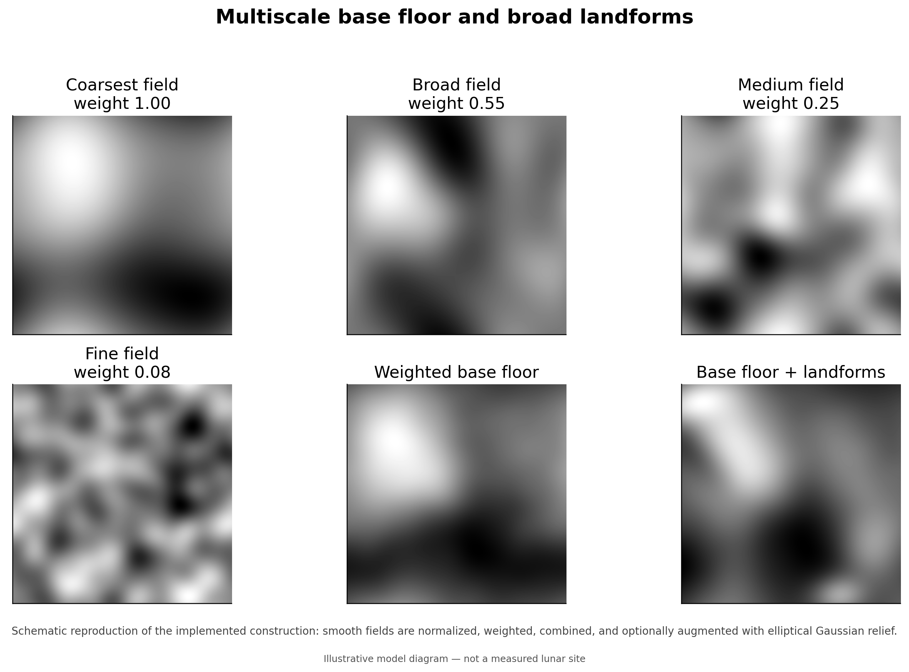
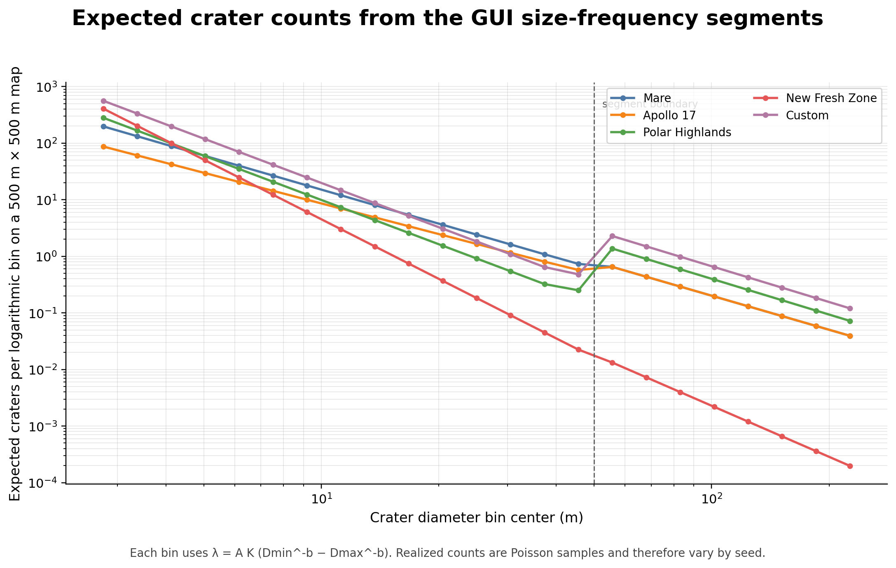
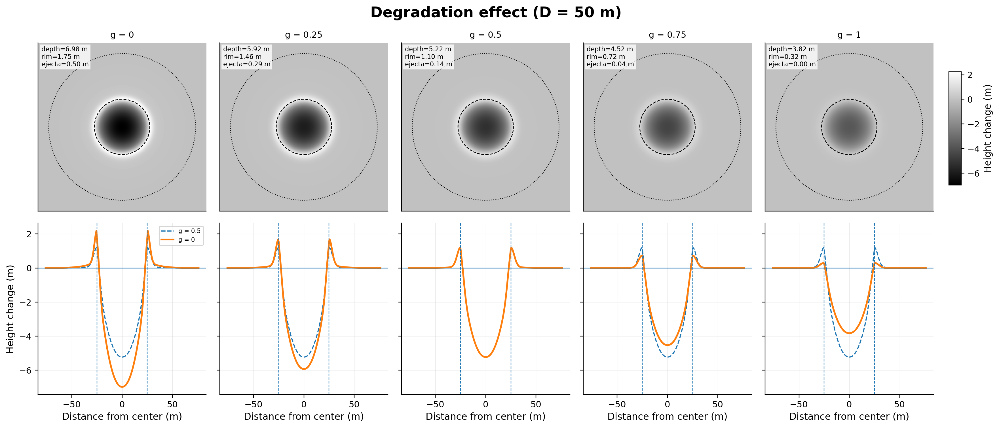
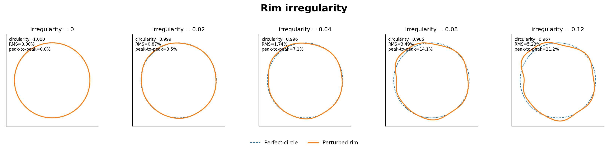
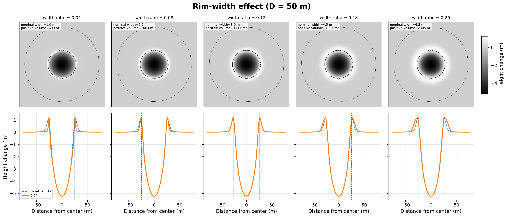
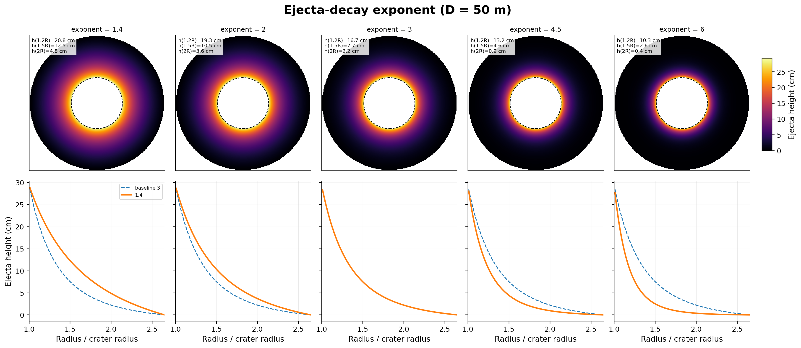
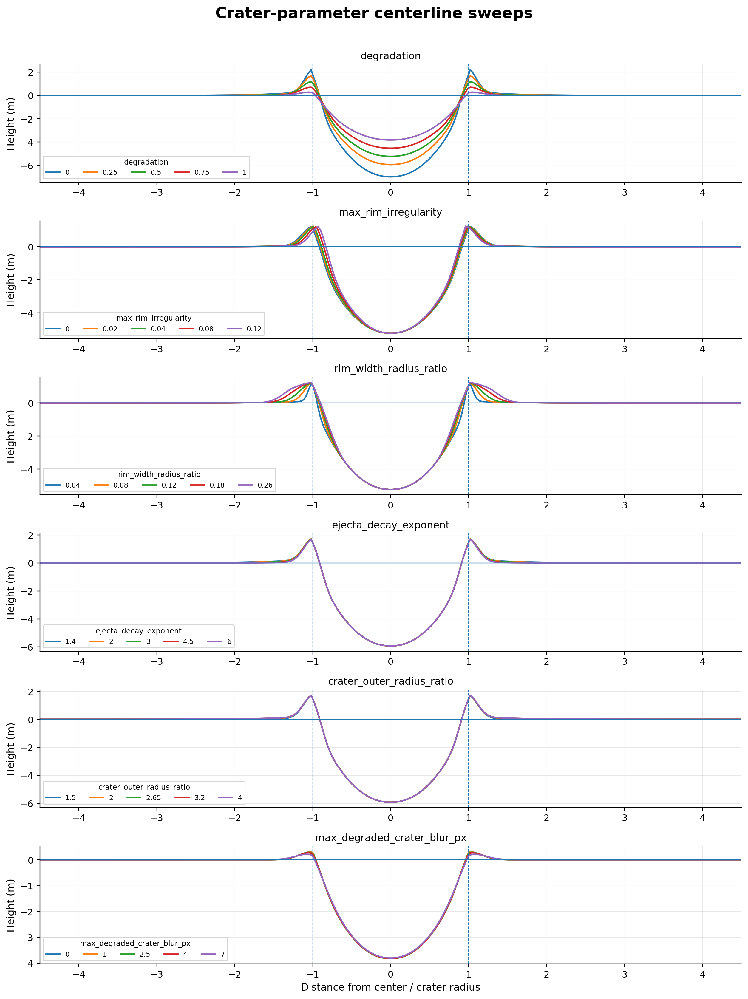

# Heightmap and crater generation model

This page describes the heightmap and crater-generation model implemented by
`Tools/Terrain_Generation/heightmap_generator.py` and configured by the MoonSim
asset-generator GUI. For generation, analysis, and Unreal import instructions, see
[Terrain generation](terrain-generation.md).

The model is a **scientifically informed procedural terrain model**. It uses
published lunar crater statistics and morphology as constraints, then combines
them with procedural surface synthesis suitable for finite Unreal Engine maps.
It is not a geophysical evolution simulation, a reconstruction of an exact
landing site, or a substitute for a measured digital elevation model.


## Model overview

The generated elevation field is built in the following order:

1. Create a smooth, low-frequency base floor from deterministic multiscale
   random fields.
2. Add optional broad elliptical hills and basins.
3. Sample a piecewise crater size-frequency distribution.
4. Assign each crater a position, diameter, degradation state, rim
   irregularity, and orientation.
5. Optionally remove some small craters from steep parts of the base terrain.
6. Integrate the remaining craters into a local reference surface, oldest
   first and freshest last.
7. Add optional fresh-crater blocky relief and small-scale regolith roughness.
8. Recenter the elevation field and encode it as a 16-bit Landscape heightmap.

The seed controls every stochastic stage. Reusing the same code, complete
settings, and seed produces the same output.


## Base floor

The base floor is the weighted sum of four smooth random fields. The source
fields use grids of 5, 9, 17, and 33 samples per side, with weights 1.00, 0.55,
0.25, and 0.08. Each field is enlarged to the requested output resolution,
blurred, normalized, and combined. The result is scaled by `base_relief_m` and
blurred again using `floor_final_blur_px`.

This stage creates broad, nonperiodic relief. The exact noise grids, weights,
and blur radii are procedural design choices rather than measured lunar power
spectra.

## Broad landforms

When `add_broad_landforms` is enabled, the generator adds a preset-dependent
number of elliptical Gaussian hills and basins. Each feature receives a random
center, radius, elongation, orientation, and signed height within the preset
limits.

These features provide regional relief such as subdued rises, basins, and
highland-like forms. They are explicitly an art-direction layer; they do not
model a named geological unit or an impact basin formation process.



## Crater size-frequency distribution

Each preset defines two cumulative crater size-frequency distribution segments.
For one segment, the implemented cumulative density law is:

```text
N(>=D) per m² = K D^-b
```

For map area `A`, the expected number of craters between `D_min` and `D_max`
is:

```text
lambda = A K (D_min^-b - D_max^-b)
```

The realized segment count is sampled from a Poisson distribution with mean
`lambda`. Diameters are then sampled from the corresponding truncated power
law. Crater centers are uniform over the map.

`K` controls abundance and `b` controls the relative proportion of small and
large craters. A larger `b` produces proportionally more small craters.



### GUI crater segments

| GUI preset | Diameter segment 1 | `K1` | `b1` | Diameter segment 2 | `K2` | `b2` |
| --- | ---: | ---: | ---: | ---: | ---: | ---: |
| Mare | 2.5–50 m | 0.015 | 2.00 | 50–250 m | 0.020 | 2.00 |
| Apollo 17 | 2.5–50 m | 0.006 | 1.80 | 50–250 m | 0.020 | 2.00 |
| Polar Highlands | 2.5–50 m | 0.030 | 2.60 | 50–250 m | 0.060 | 2.10 |
| New Fresh Zone | 2.5–50 m | 0.080 | 3.50 | 50–250 m | 0.015 | 3.00 |
| Custom | 2.5–50 m | 0.060 | 2.60 | 50–250 m | 0.100 | 2.10 |

The GUI exposes `K1` and `K2`; it does not expose the segment diameter limits or
exponents. The second 50–250 m segment is partly a procedural extension chosen
to keep larger visible craters sparse or preset-appropriate on a 500 m map.

## Degradation and crater depth

Each sampled crater receives a degradation value `g` in `[0, 1]`, where `0`
represents the fresh endmember and `1` the most degraded endmember.

The implementation maps degradation onto mean depth-to-diameter ratios used for
small-crater morphology classes:

| Degradation | Morphology endmember | Base `d/D` |
| ---: | --- | ---: |
| 0.00 | A | 0.15 |
| 0.25 | AB | 0.12 |
| 0.50 | B | 0.10 |
| 0.75 | BC | 0.08 |
| 1.00 | C | 0.06 |

Intermediate values are linearly interpolated. The result is blended with the
preset's `simple_depth_ratio`, multiplied by a mild preset factor, tapered for
large fresh craters, and finally limited to `0.035 <= d/D <= 0.18`.

This part is constrained by the small-crater morphology work of Mahanti et al.
The exact blending weights, large-crater taper, and final bounds are
implementation choices.



## Crater integration

A crater is not added as a simple elevation stamp. For each crater, the
algorithm extracts and smooths the terrain beneath the crater to form a local
reference surface. The crater bowl replaces the original terrain relative to
that reference, while the rim and ejecta are added as positive relief.

For normalized radius `r`, the inner bowl follows the implemented profile:

```text
bowl(r) = -depth (1 - r^2.15), for r <= 1
```

The rim is a Gaussian centered near `r = 1`. Its width increases with
degradation, while its height decreases using a procedural degradation law.
The ejecta apron begins outside the rim and decays approximately as
`r^-ejecta_decay_exponent` until `crater_outer_radius_ratio`.

The final crater operation is smoothly blended back into the original terrain.
Old craters receive stronger local smoothing. Craters are processed in order
from more degraded to fresher, so fresh craters can overprint older terrain.

The bowl construction, rim Gaussian, ejecta decay, blend masks, and rim
irregularity harmonics are procedural geometry constrained by observed lunar
crater behavior. They are not a hydrocode impact solution.







## Slope-dependent crater retention

The highland and Apollo 17 presets can remove a fraction of small craters from
steep parts of the base terrain. Local slope is calculated before crater
integration. The survival probability decreases procedurally between about
10 degrees and 25 degrees, primarily for craters below about 180 m.

This represents the observed tendency for steep terrain to retain fewer
recognizable small craters. The exact probability function and preset strengths
are not direct fits to a measured site.

## Secondary chains and fresh blockiness

For eligible craters at least 30 m in diameter, `secondary_chain_probability`
can create a short aligned group of three to seven smaller craters. This is a
conservative procedural representation of secondary or self-secondary crater
clusters; most craters still come from the two primary size-frequency segments.

Fresh presets can also add positive Gaussian bumps around young craters. These
bumps provide blocky relief in the heightmap. They are separate from the
explicit rock instances generated later by `rockfield_generator.py`.

## Post-crater roughness and export

A final blurred random field, scaled by `post_regolith_roughness_m`, adds small
surface texture. Optional crater-floor roughness exists in the generator but is
zero in the current GUI presets unless manually overridden outside the GUI.

The elevation field is mean-centered and encoded to 16-bit PNG. In fixed range
mode, the selected height range defines the Unreal Landscape Z scale. Dither of
less than one 16-bit level is added to reduce banding. The preview sun azimuth
and elevation affect hillshade metadata only and do not affect the heightmap.

## Preset morphology controls

The table below lists selected heightmap preset values. These are defaults, not
validated physical bounds.

| GUI preset | Base relief | Broad landforms | Degradation range | Target `d/D` | Rim strength | Ejecta strength | Fresh blockiness | Slope-loss strength |
| --- | ---: | ---: | ---: | ---: | ---: | ---: | ---: | ---: |
| Mare | 2.2 m | 18 | 0.75–1.00 | 0.060 | 0.45 | 0.20 | 0.03 | 0.10 |
| Apollo 17 | 4.0 m | 32 | 0.75–1.00 | 0.060 | 0.55 | 0.30 | 0.20 | 0.35 |
| Polar Highlands | 6.0 m | 42 | 0.65–1.00 | 0.075 | 0.70 | 0.35 | 0.15 | 0.55 |
| New Fresh Zone | 5.0 m | 22 | 0.00–0.45 | 0.145 | 1.20 | 1.50 | 0.80 | 0.20 |
| Custom | 6.5 m | 48 | 0.60–1.00 | 0.080 | 0.75 | 0.40 | 0.20 | 0.50 |

<!-- ## Scientific basis

The implementation uses the literature in the following limited ways:

- **Mahanti et al. (2018):** motivates the degradation scale and the small
  crater depth-to-diameter class endmembers. The study found that small craters
  at Apollo 16 and 17 are commonly degraded and generally shallower than older
  large-crater scaling laws would predict.
- **Minton et al. (2019):** motivates the cumulative exponent near 2 for
  equilibrium small-crater populations on lunar maria and the subdued old-mare
  interpretation.
- **Bugiolacchi and Wöhler (2020):** motivates the shallower Apollo 17 small
  crater segment and the distinction between mare-like plains and more strongly
  modified upland terrain. The exact `K` conversion and the larger-crater
  segment remain implementation choices.
- **Plescia and Robinson (2019):** motivates the fresh-ejecta endmember,
  variability between clastic ejecta and impact melt, and the optional
  self-secondary-chain representation.
- **Williams et al. (2022):** motivates treating blocky, high-rock-abundance
  fresh ejecta differently from ordinary regolith and recognizing that target
  properties can suppress observed small-crater frequencies.
- **Oetting et al. (2023):** supports using steep cumulative small-crater
  distributions around young Copernican craters while also emphasizing that
  target properties, degradation, and secondaries affect the measured slope. -->

## What is measured and what is procedural

| Component | Status in MoonSim |
| --- | --- |
| General crater SFD slopes and regional abundance order | Literature-constrained |
| Fresh-to-degraded small-crater `d/D` behavior | Literature-constrained |
| Fresh ejecta being rougher and more blocky than old mare | Literature-constrained qualitatively |
| Exact `K` conversion used by a GUI preset | Implementation-derived |
| Second 50–250 m SFD segment | Partly procedural |
| Base-floor noise spectrum | Procedural |
| Number, radius, height, and elongation of broad landforms | Procedural |
| Exact bowl exponent, rim width, rim-decay law, and ejecta-height law | Procedural, observation-constrained |
| Slope survival probability | Procedural, observation-motivated |
| Secondary-chain geometry and probability | Procedural, observation-motivated |
| Regolith and crater-floor roughness | Procedural |

## References

- Mahanti, P., Robinson, M. S., Thompson, T. J., and Henriksen, M. R. (2018),
  *Small lunar craters at the Apollo 16 and 17 landing sites—morphology and
  degradation*, Icarus 299, 475–501.
  <https://doi.org/10.1016/j.icarus.2017.08.018>
- Minton, D. A., Fassett, C. I., Hirabayashi, M., Howl, B. A., and Richardson,
  J. E. (2019), *The equilibrium size-frequency distribution of small craters
  reveals the effects of distal ejecta on lunar landscape morphology*, Icarus
  326, 63–87. <https://doi.org/10.1016/j.icarus.2019.02.021>
- Bugiolacchi, R., and Wöhler, C. (2020), *Small craters population as a useful
  geological investigative tool: Apollo 17 region as a case study*, Icarus
  350, 113927. <https://doi.org/10.1016/j.icarus.2020.113927>
- Plescia, J. B., and Robinson, M. S. (2019), *Giordano Bruno: Small crater
  populations—implications for self-secondary cratering*, Icarus 321, 974–993.
  <https://doi.org/10.1016/j.icarus.2018.09.029>
- Williams, J.-P., et al. (2022), *The effects of terrain properties upon the
  small crater population distribution at Giordano Bruno: Implications for
  lunar chronology*, Journal of Geophysical Research: Planets 127,
  e2021JE007131. <https://doi.org/10.1029/2021JE007131>
- Oetting, A., Schmedemann, N., Hiesinger, H., and van der Bogert, C. H. (2023),
  *Slopes of lunar crater size-frequency distributions at Copernican-aged
  craters*, Journal of Geophysical Research: Planets 128, e2023JE007816.
  <https://doi.org/10.1029/2023JE007816>